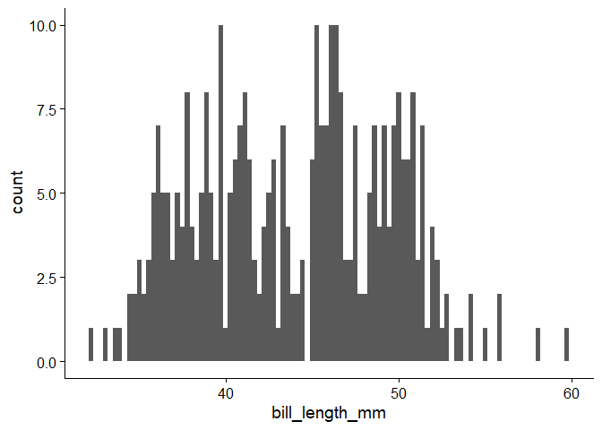
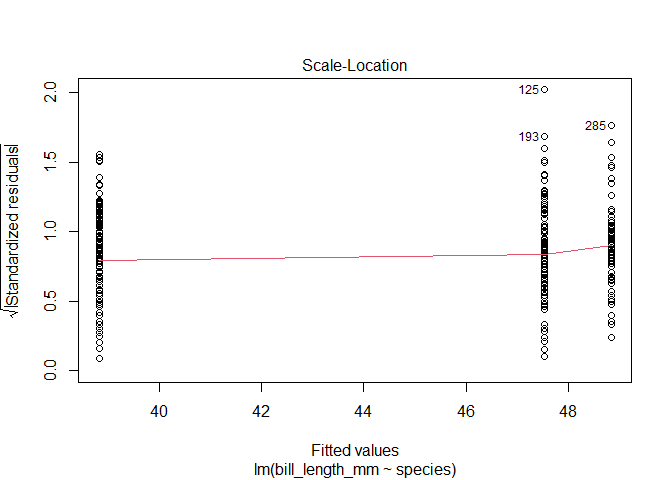
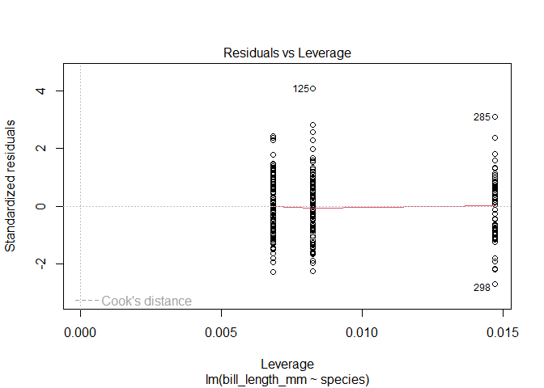
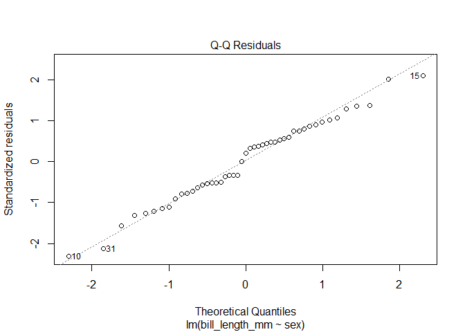
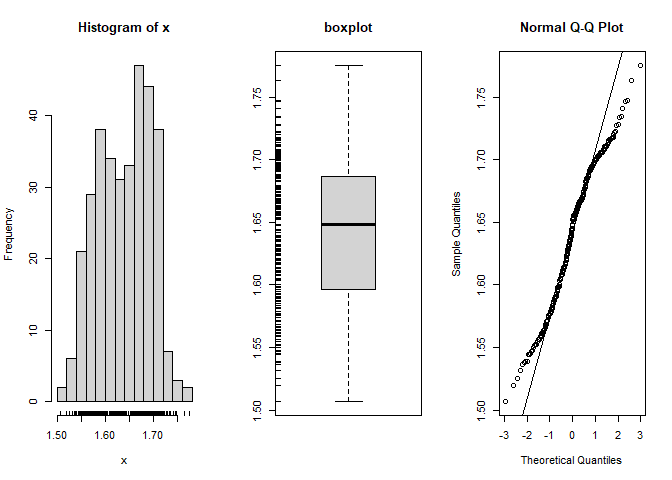
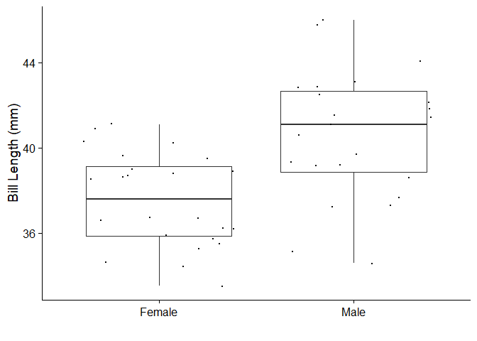
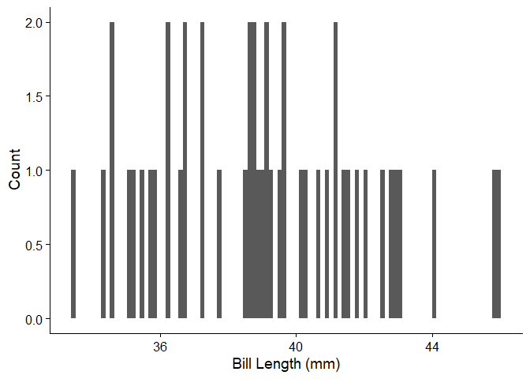
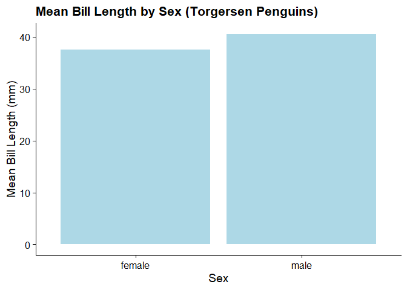
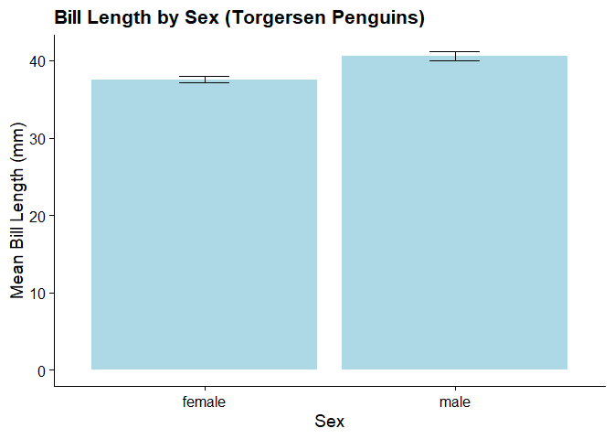

Group Project 1
================
2 Oct 2024

### Start by loading the data and packages

First, we need to look at our data file and understand what we are
dealing with. In our example, the penguin data for three different
islands is split up between three sheets in the .xlsx file. In order to
read in strictly excel files, you must use the read_excel function. It
is also important to note that the multiple sheets can cause issues, so
you have to read them in sheet by sheet. Binding the data with rbind
allows us to have each sheet into one data frame in R.

We will need to import the correct library that allows us to read .xlsx
files in R. Then, we will need to extract each sheet in the .xlsx file
into its own dataframe. It would be helpful for us to use the
as.data.frame() function to convert the data to dataframes with correct
variable types.

``` r
library(readxl)

torgersenpen <- read_excel("penguins.xlsx", sheet = "Torgersen Island")
biscoepen <- read_excel("penguins.xlsx", sheet = "Biscoe Island")
dreampen <- read_excel("penguins.xlsx", sheet = "Dream Island")

torgbisc <- rbind(torgersenpen, biscoepen)

full <- rbind(torgbisc, dreampen)
fullframe <- as.data.frame(full)
View(fullframe)
```

\#load required packages

Packages are required to run certain funtions in R, the main ones being
used here include ‘conflicted’, ‘tidyverse’, ‘dplyr’, ‘ggplot2’, and
‘cowplot’. These same packages can be found in the “Packages” tab in the
lower right panel.

``` r
if (!require("conflicted")) install.packages("conflicted"); library(conflicted) # For dealing with conflicts
```

    ## Loading required package: conflicted

``` r
if (!require("tidyverse")) install.packages("tidyverse"); library(tidyverse) # For everything
```

    ## Loading required package: tidyverse

    ## ── Attaching core tidyverse packages ──────────────────────── tidyverse 2.0.0 ──
    ## ✔ dplyr     1.1.4     ✔ readr     2.1.5
    ## ✔ forcats   1.0.0     ✔ stringr   1.5.1
    ## ✔ ggplot2   3.5.1     ✔ tibble    3.2.1
    ## ✔ lubridate 1.9.3     ✔ tidyr     1.3.1
    ## ✔ purrr     1.0.2

``` r
conflict_prefer_all("dplyr", quiet = TRUE)
if (!require("dplyr")) install.packages("dplyr"); library(dplyr)
if (!require("ggplot2")) install.packages("ggplot2"); library(ggplot2)
if (!require("cowplot")) install.packages("cowplot"); library(cowplot)
```

    ## Loading required package: cowplot

``` r
if (!require("UsingR")) install.packages("UsingR"); library(UsingR) # For the simple.eda function
```

    ## Loading required package: UsingR
    ## Loading required package: MASS
    ## 
    ## Attaching package: 'MASS'
    ## 
    ## The following object is masked from 'package:dplyr':
    ## 
    ##     select
    ## 
    ## Loading required package: HistData
    ## Loading required package: Hmisc
    ## 
    ## Attaching package: 'Hmisc'
    ## 
    ## The following objects are masked from 'package:dplyr':
    ## 
    ##     src, summarize
    ## 
    ## The following objects are masked from 'package:base':
    ## 
    ##     format.pval, units

### Make sure the data is read correctly

Even though you may not be familiar with the data set we are using, we
will walk through how to check if your data set was read correctly into
R. Checking the rows, columns, and total numbers reassures that no data
is missing.

The View() function allows you to see the whole data set completely.

\#Check columns and rows

Looking at these makes sure we have loaded in all the data and each
variable.

``` r
nrow(fullframe)
```

    ## [1] 335

``` r
ncol(fullframe)
```

    ## [1] 8

``` r
View(fullframe)
```

\#Check top and bottom of data

The top and the bottom also can show us the kind of data we are looking
at, as well as the framework of the set.

``` r
head(fullframe)
```

    ##   species    island bill_length_mm bill_depth_mm flipper_length_mm body_mass_g
    ## 1  Adelie Torgersen           39.1          18.7               181        3750
    ## 2  Adelie Torgersen           39.5          17.4               186        3800
    ## 3  Adelie Torgersen           40.3          18.0               195        3250
    ## 4  Adelie Torgersen           36.7          19.3               193        3450
    ## 5  Adelie Torgersen           39.3          20.6               190        3650
    ## 6  Adelie Torgersen           38.9          17.8               181        3625
    ##      sex year
    ## 1   male 2007
    ## 2 female 2007
    ## 3 female 2007
    ## 4 female 2007
    ## 5   male 2007
    ## 6 female 2007

``` r
tail(fullframe)
```

    ##       species island bill_length_mm bill_depth_mm flipper_length_mm body_mass_g
    ## 330 Chinstrap  Dream           45.7          17.0               195        3650
    ## 331 Chinstrap  Dream           55.8          19.8               207        4000
    ## 332 Chinstrap  Dream           43.5          18.1               202        3400
    ## 333 Chinstrap  Dream           49.6          18.2               193        3775
    ## 334 Chinstrap  Dream           50.8          19.0               210        4100
    ## 335 Chinstrap  Dream           50.2          18.7               198        3775
    ##        sex year
    ## 330 female 2009
    ## 331   male 2009
    ## 332 female 2009
    ## 333   male 2009
    ## 334   male 2009
    ## 335 female 2009

\#Run glimpse and catagorize data

In the bottom left panel, type “?glimpse” and press enter. What does it
show you? Glimpse in the package dplyr allows us to see every column in
the data frame. This simply shows you as much data as possible.

Then, we get into the function mutate. This allows us to change the type
of variable for our data. R automatically read our data but we need to
change the factor variables to factors and the numeric variables to
numbers. The as.factor() function is used for the variables sex, island,
and species. As you can see, you can also do levels within the factor,
as portrayed in the island line of code.

The next code shows the same process but with the as.numeric function
for the numerical values of bill length, bill depth, flipper length, and
body mass.

Using the summary() function, you can see if the as.factor and
as.numeric functions worked.

``` r
glimpse(fullframe)
```

    ## Rows: 335
    ## Columns: 8
    ## $ species           <chr> "Adelie", "Adelie", "Adelie", "Adelie", "Adelie", "A…
    ## $ island            <chr> "Torgersen", "Torgersen", "Torgersen", "Torgersen", …
    ## $ bill_length_mm    <dbl> 39.1, 39.5, 40.3, 36.7, 39.3, 38.9, 39.2, 41.1, 38.6…
    ## $ bill_depth_mm     <dbl> 18.7, 17.4, 18.0, 19.3, 20.6, 17.8, 19.6, 17.6, 21.2…
    ## $ flipper_length_mm <dbl> 181, 186, 195, 193, 190, 181, 195, 182, 191, 198, 18…
    ## $ body_mass_g       <dbl> 3750, 3800, 3250, 3450, 3650, 3625, 4675, 3200, 3800…
    ## $ sex               <chr> "male", "female", "female", "female", "male", "femal…
    ## $ year              <dbl> 2007, 2007, 2007, 2007, 2007, 2007, 2007, 2007, 2007…

``` r
fullframe |> 
  mutate(sex = as.factor(sex),
         island = factor(island, levels = c("Dream", "Torgersen", "Biscoe")),
         species = as.factor(species)) -> fullframe


fullframe |>
  mutate(bill_length_mm = as.numeric(bill_length_mm),
         bill_depth_mm = as.numeric(bill_depth_mm),
         flipper_length_mm = as.numeric(flipper_length_mm),
         body_mass_g = as.numeric(body_mass_g)) -> fullframe
summary(fullframe)
```

    ##       species          island    bill_length_mm  bill_depth_mm  
    ##  Adelie   :146   Dream    :123   Min.   :32.10   Min.   :13.10  
    ##  Chinstrap: 68   Torgersen: 47   1st Qu.:39.50   1st Qu.:15.55  
    ##  Gentoo   :121   Biscoe   :165   Median :44.50   Median :17.30  
    ##                                  Mean   :44.00   Mean   :17.15  
    ##                                  3rd Qu.:48.55   3rd Qu.:18.70  
    ##                                  Max.   :59.60   Max.   :21.50  
    ##  flipper_length_mm  body_mass_g       sex           year     
    ##  Min.   :172.0     Min.   :2700   female:165   Min.   :2007  
    ##  1st Qu.:190.0     1st Qu.:3550   male  :168   1st Qu.:2007  
    ##  Median :197.0     Median :4050   NA    :  2   Median :2008  
    ##  Mean   :201.1     Mean   :4208                Mean   :2008  
    ##  3rd Qu.:213.0     3rd Qu.:4762                3rd Qu.:2009  
    ##  Max.   :231.0     Max.   :6300                Max.   :2009

\#Check ’n’s

Again, although you are likely unfamiliar with this data set, the
following code allows you to see the total number of observations made
in the data set. If this did not match your original data you collected,
you would have been made aware that the data didn’t read in correctly.

``` r
str(fullframe)
```

    ## 'data.frame':    335 obs. of  8 variables:
    ##  $ species          : Factor w/ 3 levels "Adelie","Chinstrap",..: 1 1 1 1 1 1 1 1 1 1 ...
    ##  $ island           : Factor w/ 3 levels "Dream","Torgersen",..: 2 2 2 2 2 2 2 2 2 2 ...
    ##  $ bill_length_mm   : num  39.1 39.5 40.3 36.7 39.3 38.9 39.2 41.1 38.6 34.6 ...
    ##  $ bill_depth_mm    : num  18.7 17.4 18 19.3 20.6 17.8 19.6 17.6 21.2 21.1 ...
    ##  $ flipper_length_mm: num  181 186 195 193 190 181 195 182 191 198 ...
    ##  $ body_mass_g      : num  3750 3800 3250 3450 3650 ...
    ##  $ sex              : Factor w/ 3 levels "female","male",..: 2 1 1 1 2 1 2 1 2 2 ...
    ##  $ year             : num  2007 2007 2007 2007 2007 ...

``` r
table(fullframe$bill_length_mm)
```

    ## 
    ## 32.1 33.1 33.5   34 34.4 34.5 34.6   35 35.1 35.2 35.3 35.5 35.6 35.7 35.9   36 
    ##    1    1    1    1    1    1    2    2    1    1    1    2    1    3    2    4 
    ## 36.2 36.3 36.4 36.5 36.6 36.7 36.8 36.9   37 37.2 37.3 37.5 37.6 37.7 37.8 37.9 
    ##    3    1    2    2    2    2    1    1    2    2    3    1    3    3    3    2 
    ## 38.1 38.2 38.3 38.5 38.6 38.7 38.8 38.9   39 39.1 39.2 39.3 39.5 39.6 39.7 39.8 
    ##    4    2    1    1    3    1    3    2    3    1    3    1    3    5    4    1 
    ## 40.1 40.2 40.3 40.5 40.6 40.7 40.8 40.9   41 41.1 41.3 41.4 41.5 41.6 41.7 41.8 
    ##    1    3    2    2    4    1    2    4    1    7    2    2    2    1    1    1 
    ##   42 42.1 42.2 42.3 42.4 42.5 42.6 42.7 42.8 42.9 43.1 43.2 43.3 43.4 43.5 43.6 
    ##    2    1    2    1    1    3    1    2    2    2    1    4    2    1    3    1 
    ## 43.8   44 44.1 44.4 44.5 44.9   45 45.1 45.2 45.3 45.4 45.5 45.6 45.7 45.8 45.9 
    ##    1    1    2    1    2    2    1    3    6    2    2    5    2    3    3    1 
    ##   46 46.1 46.2 46.3 46.4 46.5 46.6 46.7 46.8 46.9   47 47.2 47.3 47.4 47.5 47.6 
    ##    2    3    5    1    4    5    2    2    4    2    1    2    1    1    4    2 
    ## 47.7 47.8 48.1 48.2 48.4 48.5 48.6 48.7 48.8   49 49.1 49.2 49.3 49.4 49.5 49.6 
    ##    1    1    2    2    3    3    1    3    1    3    3    2    2    1    3    3 
    ## 49.7 49.8 49.9   50 50.1 50.2 50.3 50.4 50.5 50.6 50.7 50.8 50.9   51 51.1 51.3 
    ##    1    3    1    5    2    3    1    2    5    1    2    4    2    1    2    4 
    ## 51.4 51.5 51.7 51.9   52 52.1 52.2 52.5 52.7 52.8 53.4 53.5 54.2 54.3 55.1 55.8 
    ##    1    2    1    1    3    1    2    1    1    1    1    1    1    1    1    1 
    ## 55.9   58 59.6 
    ##    1    1    1

``` r
table(fullframe$sex)
```

    ## 
    ## female   male     NA 
    ##    165    168      2

### Plot the residuals

First, lets look at the data. Using the ggplot() function, we can create
a histogram (geom_histogram()) with the bill length (part of our
original hypothesis). It is important to note that each time you create
a graph, you have to explicitly state where you want the data pulled
from. The theme_cowplot simply makes the graph pretty.

For the second graph, certain features are added (including changing the
data frame) to the aesthetic function (aes()) to make the graph
specialized. With the colour() fucntion, you can group data within a
graph. fill() simply makes it look better (play around with it and see
what happends without the fill option!). The binwidth is another way to
alter your graph with different widths (play around with this too! Try
0.5, then 3. What looks better?) With the position() function, it just
indicates where your legend is. You will learn how to better visualize
the data later.

``` r
ggplot(fullframe) +
  aes(x = bill_length_mm) +
  geom_histogram(bins = 100) +
  theme_cowplot()
```

<!-- -->

``` r
ggplot(torgersenpen) +
  aes(x = bill_length_mm, colour = sex, fill = sex) +
  geom_histogram(binwidth = 1.5,  position = "dodge") +
  theme_cowplot()
```

<!-- -->

Residuals are the difference between an observed data value and a
predicted data value. When we plot them, it allows us to see visually
whether or not the data is normal or not. Using lm(), we can look at the
residuals of the linear models we make. So, for our first relationship
we want to look at (bill length and species), the code follows this
pattern: name of linear model \<- lm(bill length depends on(~) species,
from the data frame fullframe)

We can do a similar thing with our second relationship (bill length and
sex). The one thing that needed to be changed was the fact that the data
set torgersenpen had the specific data we needed, without the clutter of
the fullframe data set.

plot() graphs the linear models that you just made.

``` r
lmspecieslength <- lm(bill_length_mm ~ species, data = fullframe)
summary(lmspecieslength)
```

    ## 
    ## Call:
    ## lm(formula = bill_length_mm ~ species, data = fullframe)
    ## 
    ## Residuals:
    ##     Min      1Q  Median      3Q     Max 
    ## -7.9338 -2.2314  0.0686  2.0674 12.0686 
    ## 
    ## Coefficients:
    ##                  Estimate Std. Error t value Pr(>|t|)    
    ## (Intercept)       38.8240     0.2456  158.06   <2e-16 ***
    ## speciesChinstrap  10.0099     0.4358   22.97   <2e-16 ***
    ## speciesGentoo      8.7074     0.3649   23.86   <2e-16 ***
    ## ---
    ## Signif. codes:  0 '***' 0.001 '**' 0.01 '*' 0.05 '.' 0.1 ' ' 1
    ## 
    ## Residual standard error: 2.968 on 332 degrees of freedom
    ## Multiple R-squared:  0.7056, Adjusted R-squared:  0.7038 
    ## F-statistic: 397.8 on 2 and 332 DF,  p-value: < 2.2e-16

``` r
lmsexlength <- lm(bill_length_mm ~ sex, data = torgersenpen)
summary(lmsexlength)
```

    ## 
    ## Call:
    ## lm(formula = bill_length_mm ~ sex, data = torgersenpen)
    ## 
    ## Residuals:
    ##    Min     1Q Median     3Q    Max 
    ## -5.987 -1.754  0.513  1.929  5.413 
    ## 
    ## Coefficients:
    ##             Estimate Std. Error t value Pr(>|t|)    
    ## (Intercept)  37.5542     0.5390  69.673  < 2e-16 ***
    ## sexmale       3.0328     0.7705   3.936 0.000284 ***
    ## ---
    ## Signif. codes:  0 '***' 0.001 '**' 0.01 '*' 0.05 '.' 0.1 ' ' 1
    ## 
    ## Residual standard error: 2.641 on 45 degrees of freedom
    ## Multiple R-squared:  0.2561, Adjusted R-squared:  0.2396 
    ## F-statistic: 15.49 on 1 and 45 DF,  p-value: 0.0002844

``` r
plot(lmspecieslength)
```

<!-- --><!-- --><!-- --><!-- -->

``` r
plot(lmsexlength)
```

<!-- --><!-- --><!-- --><!-- -->

### 4. Discuss the residuals

Although these graphs are a lot, the main ones we will focus on (to stay
within the scope of this tutorial) are the QQ plots. A QQ plot basically
shows how well the data matches the theoretical normal distribution. If
all of the points are roughly along the dotted line, that means the data
is mostly normally distributed. If the data points do not fit along the
line at all it means the data is highly skewed.

For these, it looks like the data is fairly normalized. The data on both
the bill length ~ species and the bill length ~ sex look normal with
closely fit data on the line. Normally, this would be it for making sure
our data is normalized since it already looks normal, but the following
code gives some tips on how to normalize a skewed set.

### 5. Figure out how to normalize the data and plot residuals

Using this following code, this allows us to take log10 of the bill
length. Although our data looks fairly normalized, what would happen if
you took the log10 of it?

``` r
fullframe$log10bill_length <- log10(fullframe$bill_length_mm)
simple.eda(fullframe$log10bill_length)
```

<!-- --> As
you can see, it doesn’t make it that much better, it even makes the QQ
plot look worse. Since we are lucky with a normal data set, we don’t
need to use any normalizing functions.

\##Visualization of Your Data

The Hypothesis that we are testing are: -Is Bill Length in Penguins from
Torgersen’s Island is Sex Dependent -Is Bill Length is different between
the 3 species

We will be visualizing “Is Bill Length in Penguins from Torgersen’s
Island is Sex Dependent.”

First view your data and get familiar with your variables. In this
tutorial we will be testing if the Bill Length is different between the
3 species, and if Bill length in Penguins from Torgersen’s Island is Sex
Dependent.

There are two simple ways to get a basic view of your data. You can
simply type the name of your dataset to view the full data. You can also
use summary(YourDataSet) to view the dataset with some summary
statistics. Try both bellow!

\#View Data

``` r
summary(torgersenpen)
```

    ##    species             island          bill_length_mm  bill_depth_mm  
    ##  Length:47          Length:47          Min.   :33.50   Min.   :15.90  
    ##  Class :character   Class :character   1st Qu.:36.65   1st Qu.:17.45  
    ##  Mode  :character   Mode  :character   Median :39.00   Median :18.40  
    ##                                        Mean   :39.04   Mean   :18.45  
    ##                                        3rd Qu.:41.10   3rd Qu.:19.25  
    ##                                        Max.   :46.00   Max.   :21.50  
    ##  flipper_length_mm  body_mass_g       sex                 year     
    ##  Min.   :176.0     Min.   :2900   Length:47          Min.   :2007  
    ##  1st Qu.:187.5     1st Qu.:3338   Class :character   1st Qu.:2007  
    ##  Median :191.0     Median :3700   Mode  :character   Median :2008  
    ##  Mean   :191.5     Mean   :3709                      Mean   :2008  
    ##  3rd Qu.:195.5     3rd Qu.:4000                      3rd Qu.:2009  
    ##  Max.   :210.0     Max.   :4700                      Max.   :2009

We created a dataset for Penguins in Torgersen’s Island called
“torgersenpenguins”. Simply type in the dataset’s name to view the data.
Try bellow.

``` r
torgersenpen
```

    ## # A tibble: 47 × 8
    ##    species island    bill_length_mm bill_depth_mm flipper_length_mm body_mass_g
    ##    <chr>   <chr>              <dbl>         <dbl>             <dbl>       <dbl>
    ##  1 Adelie  Torgersen           39.1          18.7               181        3750
    ##  2 Adelie  Torgersen           39.5          17.4               186        3800
    ##  3 Adelie  Torgersen           40.3          18                 195        3250
    ##  4 Adelie  Torgersen           36.7          19.3               193        3450
    ##  5 Adelie  Torgersen           39.3          20.6               190        3650
    ##  6 Adelie  Torgersen           38.9          17.8               181        3625
    ##  7 Adelie  Torgersen           39.2          19.6               195        4675
    ##  8 Adelie  Torgersen           41.1          17.6               182        3200
    ##  9 Adelie  Torgersen           38.6          21.2               191        3800
    ## 10 Adelie  Torgersen           34.6          21.1               198        4400
    ## # ℹ 37 more rows
    ## # ℹ 2 more variables: sex <chr>, year <dbl>

Next we will visualize the data comparing Bill Length by Sex to
visuzlize if there is a significant differrence in Bill Length,
depending on Sex.

# Basic boxplot

``` r
boxplot(bill_length_mm ~ sex, data = torgersenpen,
        xlab = "Sex",
        ylab = "Bill Length",
        main = "Boxplot of Bill Length by Sex",
        col = c("lightblue", "lightpink"))
```

<!-- -->
Now we will add jitter to our boxplot :

``` r
ggplot(torgersenpen) +
  aes(x = factor(sex), y = bill_length_mm) +
  geom_boxplot() +
  geom_jitter(color="black", size=0.4, alpha=0.9) +
  theme_cowplot() +
  ylab("Bill Length (mm)")+
  xlab(c(" "))+
  scale_x_discrete(labels=c("Female","Male"))
```

<!-- -->
\##Analyze Graph Now you want to analyze your results and look for any
differences in the data for our boxplots :

In both of boxplot we can see a significant difference between the Bill
Length. It seems that males on average have a higher bill length than
female penguins from Torgersen’s island. Of course we will have to use a
statistical test to check if this correlation is actually significant.

\#Histogram

Next we will create a Histogram to visualize the same thing in the data.

In our histogram we want to display the Bill Length on the x-axis and
separate these values by female and male.

First lets create a histogram that includes just the Bill Lenght.

``` r
ggplot(torgersenpen) +
  aes(x = bill_length_mm) +
  geom_histogram(bins=100) +
  theme_cowplot()+
  xlab("Bill Length (mm)") + 
  ylab("Count")
```

<!-- -->

Next lets separate these results by sex :

``` r
ggplot(torgersenpen) +
  aes(x = bill_length_mm, color = sex, fill = sex) +
  geom_histogram(binwidth = 0.5, position = "dodge") +
  theme_cowplot()+
    xlab("Bill Length") + 
  ylab("Count")
```

<!-- -->
Finally, lets make these results look better in our graph :

``` r
ggplot(torgersenpen) +
  aes(x = bill_length_mm,  fill = sex) + 
  geom_density(alpha=.3) +
  theme_cowplot()+
  xlab("Bill Length (mm)") + 
  ylab("Count")
```

<!-- -->
\##Analyze Graph Now you want to analyze your results and look for any
differences in the data for our Histogram :

Our Histogram displays similar results to our boxplot, in which we can
see a significant difference between the Bill Length seperated by sex.
It seems that males on average have a higher bill length than female
penguins from Torgersen’s island. Of course we will have to use a
statistical test to check if this correlation is actually significant.

\#Bar Chart

``` r
# Calculate means for bill length by sex
summary_data <- torgersenpen %>%
  group_by(sex) %>%
  summarize(mean_bill_length = mean(bill_length_mm, na.rm = TRUE))

# Create bar plot without error bars
ggplot(summary_data, aes(x = sex, y = mean_bill_length)) +
  geom_bar(stat = "identity", fill = "lightblue") +
  labs(title = "Mean Bill Length by Sex (Torgersen Penguins)",
       x = "Sex",
       y = "Mean Bill Length (mm)") +
  theme_cowplot()
```

<!-- -->

This will create a very basic Bar Chart to visualize our Data.

Next we will add error lines to this barchart:

``` r
# Calculate means and standard errors for bill length by sex
summary_data <- torgersenpen %>%
  group_by(sex) %>%
  summarize(mean_bill_length = mean(bill_length_mm, na.rm = TRUE),
            se_bill_length = sd(bill_length_mm, na.rm = TRUE) / sqrt(n()))

# Create bar plot with error bars
ggplot(summary_data, aes(x = sex, y = mean_bill_length)) +
  geom_bar(stat = "identity", fill = "lightblue") +
  geom_errorbar(aes(ymin = mean_bill_length - se_bill_length,
                    ymax = mean_bill_length + se_bill_length), 
                width = 0.2) +
  labs(title = "Bill Length by Sex (Torgersen Penguins)",
       x = "Sex",
       y = "Mean Bill Length (mm)") +
  theme_cowplot()
```

<!-- -->
\##Analyze Bar Charts

As you can see, our graphs are all consistent in that Males appear to
have a higher average Bill Lenghth then Female penguins on Torgersen’s
island. We must test this with statistical models to verify if the
correlation is actually there.

\##Analyzing Data using t-test, and Anova Now you will learn how to
analyze data using T-tests and Anova.

First, Which type of analysis to use / using t-test, anova…

- Recognize the differences between one-way, two-way, mixed, or ANCOVA
  anova test, execute the test and interpret the results
  - Determine if the explanatory variable(s) is continuous, discrete, or
    mixed
  - Understand the meaning of p-values and how it relates to a normal
    distribution
- Understand the differences between one-sample t test, two-sample t
  test, or paired t test, execute the test and interpret the results
  - Learn how to assess an experimental design in order to choose the
    appropriate t-test
  - Understand probability distributions and how it relates to t-tests

\#Checking dataframe structure using str()

``` r
str(torgersenpen)
```

    ## tibble [47 × 8] (S3: tbl_df/tbl/data.frame)
    ##  $ species          : chr [1:47] "Adelie" "Adelie" "Adelie" "Adelie" ...
    ##  $ island           : chr [1:47] "Torgersen" "Torgersen" "Torgersen" "Torgersen" ...
    ##  $ bill_length_mm   : num [1:47] 39.1 39.5 40.3 36.7 39.3 38.9 39.2 41.1 38.6 34.6 ...
    ##  $ bill_depth_mm    : num [1:47] 18.7 17.4 18 19.3 20.6 17.8 19.6 17.6 21.2 21.1 ...
    ##  $ flipper_length_mm: num [1:47] 181 186 195 193 190 181 195 182 191 198 ...
    ##  $ body_mass_g      : num [1:47] 3750 3800 3250 3450 3650 ...
    ##  $ sex              : chr [1:47] "male" "female" "female" "female" ...
    ##  $ year             : num [1:47] 2007 2007 2007 2007 2007 ...

``` r
str(biscoepen)
```

    ## tibble [165 × 8] (S3: tbl_df/tbl/data.frame)
    ##  $ species          : chr [1:165] "Adelie" "Adelie" "Adelie" "Adelie" ...
    ##  $ island           : chr [1:165] "Biscoe" "Biscoe" "Biscoe" "Biscoe" ...
    ##  $ bill_length_mm   : num [1:165] 37.8 37.7 35.9 38.2 38.8 35.3 40.6 40.5 37.9 40.5 ...
    ##  $ bill_depth_mm    : num [1:165] 18.3 18.7 19.2 18.1 17.2 18.9 18.6 17.9 18.6 18.9 ...
    ##  $ flipper_length_mm: num [1:165] 174 180 189 185 180 187 183 187 172 180 ...
    ##  $ body_mass_g      : num [1:165] 3400 3600 3800 3950 3800 3800 3550 3200 3150 3950 ...
    ##  $ sex              : chr [1:165] "female" "male" "female" "male" ...
    ##  $ year             : num [1:165] 2007 2007 2007 2007 2007 ...

``` r
str(dreampen)
```

    ## tibble [123 × 8] (S3: tbl_df/tbl/data.frame)
    ##  $ species          : chr [1:123] "Adelie" "Adelie" "Adelie" "Adelie" ...
    ##  $ island           : chr [1:123] "Dream" "Dream" "Dream" "Dream" ...
    ##  $ bill_length_mm   : num [1:123] 39.5 37.2 39.5 40.9 36.4 39.2 38.8 42.2 37.6 39.8 ...
    ##  $ bill_depth_mm    : num [1:123] 16.7 18.1 17.8 18.9 17 21.1 20 18.5 19.3 19.1 ...
    ##  $ flipper_length_mm: num [1:123] 178 178 188 184 195 196 190 180 181 184 ...
    ##  $ body_mass_g      : num [1:123] 3250 3900 3300 3900 3325 ...
    ##  $ sex              : chr [1:123] "female" "male" "female" "male" ...
    ##  $ year             : num [1:123] 2007 2007 2007 2007 2007 ...

For the sake of our data exploration, we should have a dataframe which
includes all of the data from each separate island. Using the rbind()
function, we are able to first bind the Torgersen data with the Biscoe
data. Then, we can put it all together using rbind() on the
torsergen+biscoe frame with the Dream frame. For safe measure, we will
use as.data.frame() on the full set.

``` r
torgbisc <- rbind(torgersenpen, biscoepen)

full <- rbind(torgbisc, dreampen)
fullframe <- as.data.frame(full)
fullframe
```

    ##       species    island bill_length_mm bill_depth_mm flipper_length_mm
    ## 1      Adelie Torgersen           39.1          18.7               181
    ## 2      Adelie Torgersen           39.5          17.4               186
    ## 3      Adelie Torgersen           40.3          18.0               195
    ## 4      Adelie Torgersen           36.7          19.3               193
    ## 5      Adelie Torgersen           39.3          20.6               190
    ## 6      Adelie Torgersen           38.9          17.8               181
    ## 7      Adelie Torgersen           39.2          19.6               195
    ## 8      Adelie Torgersen           41.1          17.6               182
    ## 9      Adelie Torgersen           38.6          21.2               191
    ## 10     Adelie Torgersen           34.6          21.1               198
    ## 11     Adelie Torgersen           36.6          17.8               185
    ## 12     Adelie Torgersen           38.7          19.0               195
    ## 13     Adelie Torgersen           42.5          20.7               197
    ## 14     Adelie Torgersen           34.4          18.4               184
    ## 15     Adelie Torgersen           46.0          21.5               194
    ## 16     Adelie Torgersen           35.9          16.6               190
    ## 17     Adelie Torgersen           41.8          19.4               198
    ## 18     Adelie Torgersen           33.5          19.0               190
    ## 19     Adelie Torgersen           39.7          18.4               190
    ## 20     Adelie Torgersen           39.6          17.2               196
    ## 21     Adelie Torgersen           45.8          18.9               197
    ## 22     Adelie Torgersen           35.5          17.5               190
    ## 23     Adelie Torgersen           42.8          18.5               195
    ## 24     Adelie Torgersen           40.9          16.8               191
    ## 25     Adelie Torgersen           37.2          19.4               184
    ## 26     Adelie Torgersen           36.2          16.1               187
    ## 27     Adelie Torgersen           42.1          19.1               195
    ## 28     Adelie Torgersen           34.6          17.2               189
    ## 29     Adelie Torgersen           42.9          17.6               196
    ## 30     Adelie Torgersen           36.7          18.8               187
    ## 31     Adelie Torgersen           35.1          19.4               193
    ## 32     Adelie Torgersen           38.6          17.0               188
    ## 33     Adelie Torgersen           37.3          20.5               199
    ## 34     Adelie Torgersen           35.7          17.0               189
    ## 35     Adelie Torgersen           41.1          18.6               189
    ## 36     Adelie Torgersen           36.2          17.2               187
    ## 37     Adelie Torgersen           37.7          19.8               198
    ## 38     Adelie Torgersen           40.2          17.0               176
    ## 39     Adelie Torgersen           41.4          18.5               202
    ## 40     Adelie Torgersen           35.2          15.9               186
    ## 41     Adelie Torgersen           40.6          19.0               199
    ## 42     Adelie Torgersen           38.8          17.6               191
    ## 43     Adelie Torgersen           41.5          18.3               195
    ## 44     Adelie Torgersen           39.0          17.1               191
    ## 45     Adelie Torgersen           44.1          18.0               210
    ## 46     Adelie Torgersen           38.5          17.9               190
    ## 47     Adelie Torgersen           43.1          19.2               197
    ## 48     Adelie    Biscoe           37.8          18.3               174
    ## 49     Adelie    Biscoe           37.7          18.7               180
    ## 50     Adelie    Biscoe           35.9          19.2               189
    ## 51     Adelie    Biscoe           38.2          18.1               185
    ## 52     Adelie    Biscoe           38.8          17.2               180
    ## 53     Adelie    Biscoe           35.3          18.9               187
    ## 54     Adelie    Biscoe           40.6          18.6               183
    ## 55     Adelie    Biscoe           40.5          17.9               187
    ## 56     Adelie    Biscoe           37.9          18.6               172
    ## 57     Adelie    Biscoe           40.5          18.9               180
    ## 58     Adelie    Biscoe           39.6          17.7               186
    ## 59     Adelie    Biscoe           40.1          18.9               188
    ## 60     Adelie    Biscoe           35.0          17.9               190
    ## 61     Adelie    Biscoe           42.0          19.5               200
    ## 62     Adelie    Biscoe           34.5          18.1               187
    ## 63     Adelie    Biscoe           41.4          18.6               191
    ## 64     Adelie    Biscoe           39.0          17.5               186
    ## 65     Adelie    Biscoe           40.6          18.8               193
    ## 66     Adelie    Biscoe           36.5          16.6               181
    ## 67     Adelie    Biscoe           37.6          19.1               194
    ## 68     Adelie    Biscoe           35.7          16.9               185
    ## 69     Adelie    Biscoe           41.3          21.1               195
    ## 70     Adelie    Biscoe           37.6          17.0               185
    ## 71     Adelie    Biscoe           41.1          18.2               192
    ## 72     Adelie    Biscoe           36.4          17.1               184
    ## 73     Adelie    Biscoe           41.6          18.0               192
    ## 74     Adelie    Biscoe           35.5          16.2               195
    ## 75     Adelie    Biscoe           41.1          19.1               188
    ## 76     Adelie    Biscoe           35.0          17.9               192
    ## 77     Adelie    Biscoe           41.0          20.0               203
    ## 78     Adelie    Biscoe           37.7          16.0               183
    ## 79     Adelie    Biscoe           37.8          20.0               190
    ## 80     Adelie    Biscoe           37.9          18.6               193
    ## 81     Adelie    Biscoe           39.7          18.9               184
    ## 82     Adelie    Biscoe           38.6          17.2               199
    ## 83     Adelie    Biscoe           38.2          20.0               190
    ## 84     Adelie    Biscoe           38.1          17.0               181
    ## 85     Adelie    Biscoe           43.2          19.0               197
    ## 86     Adelie    Biscoe           38.1          16.5               198
    ## 87     Adelie    Biscoe           45.6          20.3               191
    ## 88     Adelie    Biscoe           39.7          17.7               193
    ## 89     Adelie    Biscoe           42.2          19.5               197
    ## 90     Adelie    Biscoe           39.6          20.7               191
    ## 91     Adelie    Biscoe           42.7          18.3               196
    ## 92     Gentoo    Biscoe           46.1          13.2               211
    ## 93     Gentoo    Biscoe           50.0          16.3               230
    ## 94     Gentoo    Biscoe           48.7          14.1               210
    ## 95     Gentoo    Biscoe           50.0          15.2               218
    ## 96     Gentoo    Biscoe           47.6          14.5               215
    ## 97     Gentoo    Biscoe           46.5          13.5               210
    ## 98     Gentoo    Biscoe           45.4          14.6               211
    ## 99     Gentoo    Biscoe           46.7          15.3               219
    ## 100    Gentoo    Biscoe           43.3          13.4               209
    ## 101    Gentoo    Biscoe           46.8          15.4               215
    ## 102    Gentoo    Biscoe           40.9          13.7               214
    ## 103    Gentoo    Biscoe           49.0          16.1               216
    ## 104    Gentoo    Biscoe           45.5          13.7               214
    ## 105    Gentoo    Biscoe           48.4          14.6               213
    ## 106    Gentoo    Biscoe           45.8          14.6               210
    ## 107    Gentoo    Biscoe           49.3          15.7               217
    ## 108    Gentoo    Biscoe           42.0          13.5               210
    ## 109    Gentoo    Biscoe           49.2          15.2               221
    ## 110    Gentoo    Biscoe           46.2          14.5               209
    ## 111    Gentoo    Biscoe           48.7          15.1               222
    ## 112    Gentoo    Biscoe           50.2          14.3               218
    ## 113    Gentoo    Biscoe           45.1          14.5               215
    ## 114    Gentoo    Biscoe           46.5          14.5               213
    ## 115    Gentoo    Biscoe           46.3          15.8               215
    ## 116    Gentoo    Biscoe           42.9          13.1               215
    ## 117    Gentoo    Biscoe           46.1          15.1               215
    ## 118    Gentoo    Biscoe           44.5          14.3               216
    ## 119    Gentoo    Biscoe           47.8          15.0               215
    ## 120    Gentoo    Biscoe           48.2          14.3               210
    ## 121    Gentoo    Biscoe           50.0          15.3               220
    ## 122    Gentoo    Biscoe           47.3          15.3               222
    ## 123    Gentoo    Biscoe           42.8          14.2               209
    ## 124    Gentoo    Biscoe           45.1          14.5               207
    ## 125    Gentoo    Biscoe           59.6          17.0               230
    ## 126    Gentoo    Biscoe           49.1          14.8               220
    ## 127    Gentoo    Biscoe           48.4          16.3               220
    ## 128    Gentoo    Biscoe           42.6          13.7               213
    ## 129    Gentoo    Biscoe           44.4          17.3               219
    ## 130    Gentoo    Biscoe           44.0          13.6               208
    ## 131    Gentoo    Biscoe           48.7          15.7               208
    ## 132    Gentoo    Biscoe           42.7          13.7               208
    ## 133    Gentoo    Biscoe           49.6          16.0               225
    ## 134    Gentoo    Biscoe           45.3          13.7               210
    ## 135    Gentoo    Biscoe           49.6          15.0               216
    ## 136    Gentoo    Biscoe           50.5          15.9               222
    ## 137    Gentoo    Biscoe           43.6          13.9               217
    ## 138    Gentoo    Biscoe           45.5          13.9               210
    ## 139    Gentoo    Biscoe           50.5          15.9               225
    ## 140    Gentoo    Biscoe           44.9          13.3               213
    ## 141    Gentoo    Biscoe           45.2          15.8               215
    ## 142    Gentoo    Biscoe           46.6          14.2               210
    ## 143    Gentoo    Biscoe           48.5          14.1               220
    ## 144    Gentoo    Biscoe           45.1          14.4               210
    ## 145    Gentoo    Biscoe           50.1          15.0               225
    ## 146    Gentoo    Biscoe           46.5          14.4               217
    ## 147    Gentoo    Biscoe           45.0          15.4               220
    ## 148    Gentoo    Biscoe           43.8          13.9               208
    ## 149    Gentoo    Biscoe           45.5          15.0               220
    ## 150    Gentoo    Biscoe           43.2          14.5               208
    ## 151    Gentoo    Biscoe           50.4          15.3               224
    ## 152    Gentoo    Biscoe           45.3          13.8               208
    ## 153    Gentoo    Biscoe           46.2          14.9               221
    ## 154    Gentoo    Biscoe           45.7          13.9               214
    ## 155    Gentoo    Biscoe           54.3          15.7               231
    ## 156    Gentoo    Biscoe           45.8          14.2               219
    ## 157    Gentoo    Biscoe           49.8          16.8               230
    ## 158    Gentoo    Biscoe           46.2          14.4               214
    ## 159    Gentoo    Biscoe           49.5          16.2               229
    ## 160    Gentoo    Biscoe           43.5          14.2               220
    ## 161    Gentoo    Biscoe           50.7          15.0               223
    ## 162    Gentoo    Biscoe           47.7          15.0               216
    ## 163    Gentoo    Biscoe           46.4          15.6               221
    ## 164    Gentoo    Biscoe           48.2          15.6               221
    ## 165    Gentoo    Biscoe           46.5          14.8               217
    ## 166    Gentoo    Biscoe           46.4          15.0               216
    ## 167    Gentoo    Biscoe           48.6          16.0               230
    ## 168    Gentoo    Biscoe           47.5          14.2               209
    ## 169    Gentoo    Biscoe           51.1          16.3               220
    ## 170    Gentoo    Biscoe           45.2          13.8               215
    ## 171    Gentoo    Biscoe           45.2          16.4               223
    ## 172    Gentoo    Biscoe           49.1          14.5               212
    ## 173    Gentoo    Biscoe           52.5          15.6               221
    ## 174    Gentoo    Biscoe           47.4          14.6               212
    ## 175    Gentoo    Biscoe           50.0          15.9               224
    ## 176    Gentoo    Biscoe           44.9          13.8               212
    ## 177    Gentoo    Biscoe           50.8          17.3               228
    ## 178    Gentoo    Biscoe           43.4          14.4               218
    ## 179    Gentoo    Biscoe           51.3          14.2               218
    ## 180    Gentoo    Biscoe           47.5          14.0               212
    ## 181    Gentoo    Biscoe           52.1          17.0               230
    ## 182    Gentoo    Biscoe           47.5          15.0               218
    ## 183    Gentoo    Biscoe           52.2          17.1               228
    ## 184    Gentoo    Biscoe           45.5          14.5               212
    ## 185    Gentoo    Biscoe           49.5          16.1               224
    ## 186    Gentoo    Biscoe           44.5          14.7               214
    ## 187    Gentoo    Biscoe           50.8          15.7               226
    ## 188    Gentoo    Biscoe           49.4          15.8               216
    ## 189    Gentoo    Biscoe           46.9          14.6               222
    ## 190    Gentoo    Biscoe           48.4          14.4               203
    ## 191    Gentoo    Biscoe           51.1          16.5               225
    ## 192    Gentoo    Biscoe           48.5          15.0               219
    ## 193    Gentoo    Biscoe           55.9          17.0               228
    ## 194    Gentoo    Biscoe           47.2          15.5               215
    ## 195    Gentoo    Biscoe           49.1          15.0               228
    ## 196    Gentoo    Biscoe           46.8          16.1               215
    ## 197    Gentoo    Biscoe           41.7          14.7               210
    ## 198    Gentoo    Biscoe           53.4          15.8               219
    ## 199    Gentoo    Biscoe           43.3          14.0               208
    ## 200    Gentoo    Biscoe           48.1          15.1               209
    ## 201    Gentoo    Biscoe           50.5          15.2               216
    ## 202    Gentoo    Biscoe           49.8          15.9               229
    ## 203    Gentoo    Biscoe           43.5          15.2               213
    ## 204    Gentoo    Biscoe           51.5          16.3               230
    ## 205    Gentoo    Biscoe           46.2          14.1               217
    ## 206    Gentoo    Biscoe           55.1          16.0               230
    ## 207    Gentoo    Biscoe           48.8          16.2               222
    ## 208    Gentoo    Biscoe           47.2          13.7               214
    ## 209    Gentoo    Biscoe           46.8          14.3               215
    ## 210    Gentoo    Biscoe           50.4          15.7               222
    ## 211    Gentoo    Biscoe           45.2          14.8               212
    ## 212    Gentoo    Biscoe           49.9          16.1               213
    ## 213    Adelie     Dream           39.5          16.7               178
    ## 214    Adelie     Dream           37.2          18.1               178
    ## 215    Adelie     Dream           39.5          17.8               188
    ## 216    Adelie     Dream           40.9          18.9               184
    ## 217    Adelie     Dream           36.4          17.0               195
    ## 218    Adelie     Dream           39.2          21.1               196
    ## 219    Adelie     Dream           38.8          20.0               190
    ## 220    Adelie     Dream           42.2          18.5               180
    ## 221    Adelie     Dream           37.6          19.3               181
    ## 222    Adelie     Dream           39.8          19.1               184
    ## 223    Adelie     Dream           36.5          18.0               182
    ## 224    Adelie     Dream           40.8          18.4               195
    ## 225    Adelie     Dream           36.0          18.5               186
    ## 226    Adelie     Dream           44.1          19.7               196
    ## 227    Adelie     Dream           37.0          16.9               185
    ## 228    Adelie     Dream           39.6          18.8               190
    ## 229    Adelie     Dream           41.1          19.0               182
    ## 230    Adelie     Dream           36.0          17.9               190
    ## 231    Adelie     Dream           42.3          21.2               191
    ## 232    Adelie     Dream           37.3          17.8               191
    ## 233    Adelie     Dream           41.3          20.3               194
    ## 234    Adelie     Dream           36.3          19.5               190
    ## 235    Adelie     Dream           36.9          18.6               189
    ## 236    Adelie     Dream           38.3          19.2               189
    ## 237    Adelie     Dream           38.9          18.8               190
    ## 238    Adelie     Dream           35.7          18.0               202
    ## 239    Adelie     Dream           41.1          18.1               205
    ## 240    Adelie     Dream           34.0          17.1               185
    ## 241    Adelie     Dream           39.6          18.1               186
    ## 242    Adelie     Dream           36.2          17.3               187
    ## 243    Adelie     Dream           40.8          18.9               208
    ## 244    Adelie     Dream           38.1          18.6               190
    ## 245    Adelie     Dream           40.3          18.5               196
    ## 246    Adelie     Dream           33.1          16.1               178
    ## 247    Adelie     Dream           43.2          18.5               192
    ## 248    Adelie     Dream           36.8          18.5               193
    ## 249    Adelie     Dream           37.5          18.5               199
    ## 250    Adelie     Dream           38.1          17.6               187
    ## 251    Adelie     Dream           41.1          17.5               190
    ## 252    Adelie     Dream           35.6          17.5               191
    ## 253    Adelie     Dream           40.2          20.1               200
    ## 254    Adelie     Dream           37.0          16.5               185
    ## 255    Adelie     Dream           39.7          17.9               193
    ## 256    Adelie     Dream           40.2          17.1               193
    ## 257    Adelie     Dream           40.6          17.2               187
    ## 258    Adelie     Dream           32.1          15.5               188
    ## 259    Adelie     Dream           40.7          17.0               190
    ## 260    Adelie     Dream           37.3          16.8               192
    ## 261    Adelie     Dream           39.0          18.7               185
    ## 262    Adelie     Dream           39.2          18.6               190
    ## 263    Adelie     Dream           36.6          18.4               184
    ## 264    Adelie     Dream           36.0          17.8               195
    ## 265    Adelie     Dream           37.8          18.1               193
    ## 266    Adelie     Dream           36.0          17.1               187
    ## 267    Adelie     Dream           41.5          18.5               201
    ## 268 Chinstrap     Dream           46.5          17.9               192
    ## 269 Chinstrap     Dream           50.0          19.5               196
    ## 270 Chinstrap     Dream           51.3          19.2               193
    ## 271 Chinstrap     Dream           45.4          18.7               188
    ## 272 Chinstrap     Dream           52.7          19.8               197
    ## 273 Chinstrap     Dream           45.2          17.8               198
    ## 274 Chinstrap     Dream           46.1          18.2               178
    ## 275 Chinstrap     Dream           51.3          18.2               197
    ## 276 Chinstrap     Dream           46.0          18.9               195
    ## 277 Chinstrap     Dream           51.3          19.9               198
    ## 278 Chinstrap     Dream           46.6          17.8               193
    ## 279 Chinstrap     Dream           51.7          20.3               194
    ## 280 Chinstrap     Dream           47.0          17.3               185
    ## 281 Chinstrap     Dream           52.0          18.1               201
    ## 282 Chinstrap     Dream           45.9          17.1               190
    ## 283 Chinstrap     Dream           50.5          19.6               201
    ## 284 Chinstrap     Dream           50.3          20.0               197
    ## 285 Chinstrap     Dream           58.0          17.8               181
    ## 286 Chinstrap     Dream           46.4          18.6               190
    ## 287 Chinstrap     Dream           49.2          18.2               195
    ## 288 Chinstrap     Dream           42.4          17.3               181
    ## 289 Chinstrap     Dream           48.5          17.5               191
    ## 290 Chinstrap     Dream           43.2          16.6               187
    ## 291 Chinstrap     Dream           50.6          19.4               193
    ## 292 Chinstrap     Dream           46.7          17.9               195
    ## 293 Chinstrap     Dream           52.0          19.0               197
    ## 294 Chinstrap     Dream           50.5          18.4               200
    ## 295 Chinstrap     Dream           49.5          19.0               200
    ## 296 Chinstrap     Dream           46.4          17.8               191
    ## 297 Chinstrap     Dream           52.8          20.0               205
    ## 298 Chinstrap     Dream           40.9          16.6               187
    ## 299 Chinstrap     Dream           54.2          20.8               201
    ## 300 Chinstrap     Dream           42.5          16.7               187
    ## 301 Chinstrap     Dream           51.0          18.8               203
    ## 302 Chinstrap     Dream           49.7          18.6               195
    ## 303 Chinstrap     Dream           47.5          16.8               199
    ## 304 Chinstrap     Dream           47.6          18.3               195
    ## 305 Chinstrap     Dream           52.0          20.7               210
    ## 306 Chinstrap     Dream           46.9          16.6               192
    ## 307 Chinstrap     Dream           53.5          19.9               205
    ## 308 Chinstrap     Dream           49.0          19.5               210
    ## 309 Chinstrap     Dream           46.2          17.5               187
    ## 310 Chinstrap     Dream           50.9          19.1               196
    ## 311 Chinstrap     Dream           45.5          17.0               196
    ## 312 Chinstrap     Dream           50.9          17.9               196
    ## 313 Chinstrap     Dream           50.8          18.5               201
    ## 314 Chinstrap     Dream           50.1          17.9               190
    ## 315 Chinstrap     Dream           49.0          19.6               212
    ## 316 Chinstrap     Dream           51.5          18.7               187
    ## 317 Chinstrap     Dream           49.8          17.3               198
    ## 318 Chinstrap     Dream           48.1          16.4               199
    ## 319 Chinstrap     Dream           51.4          19.0               201
    ## 320 Chinstrap     Dream           45.7          17.3               193
    ## 321 Chinstrap     Dream           50.7          19.7               203
    ## 322 Chinstrap     Dream           42.5          17.3               187
    ## 323 Chinstrap     Dream           52.2          18.8               197
    ## 324 Chinstrap     Dream           45.2          16.6               191
    ## 325 Chinstrap     Dream           49.3          19.9               203
    ## 326 Chinstrap     Dream           50.2          18.8               202
    ## 327 Chinstrap     Dream           45.6          19.4               194
    ## 328 Chinstrap     Dream           51.9          19.5               206
    ## 329 Chinstrap     Dream           46.8          16.5               189
    ## 330 Chinstrap     Dream           45.7          17.0               195
    ## 331 Chinstrap     Dream           55.8          19.8               207
    ## 332 Chinstrap     Dream           43.5          18.1               202
    ## 333 Chinstrap     Dream           49.6          18.2               193
    ## 334 Chinstrap     Dream           50.8          19.0               210
    ## 335 Chinstrap     Dream           50.2          18.7               198
    ##     body_mass_g    sex year
    ## 1          3750   male 2007
    ## 2          3800 female 2007
    ## 3          3250 female 2007
    ## 4          3450 female 2007
    ## 5          3650   male 2007
    ## 6          3625 female 2007
    ## 7          4675   male 2007
    ## 8          3200 female 2007
    ## 9          3800   male 2007
    ## 10         4400   male 2007
    ## 11         3700 female 2007
    ## 12         3450 female 2007
    ## 13         4500   male 2007
    ## 14         3325 female 2007
    ## 15         4200   male 2007
    ## 16         3050 female 2008
    ## 17         4450   male 2008
    ## 18         3600 female 2008
    ## 19         3900   male 2008
    ## 20         3550 female 2008
    ## 21         4150   male 2008
    ## 22         3700 female 2008
    ## 23         4250   male 2008
    ## 24         3700 female 2008
    ## 25         3900   male 2008
    ## 26         3550 female 2008
    ## 27         4000   male 2008
    ## 28         3200 female 2008
    ## 29         4700   male 2008
    ## 30         3800 female 2008
    ## 31         4200   male 2008
    ## 32         2900 female 2009
    ## 33         3775   male 2009
    ## 34         3350 female 2009
    ## 35         3325   male 2009
    ## 36         3150 female 2009
    ## 37         3500   male 2009
    ## 38         3450 female 2009
    ## 39         3875   male 2009
    ## 40         3050 female 2009
    ## 41         4000   male 2009
    ## 42         3275 female 2009
    ## 43         4300   male 2009
    ## 44         3050 female 2009
    ## 45         4000   male 2009
    ## 46         3325 female 2009
    ## 47         3500   male 2009
    ## 48         3400 female 2007
    ## 49         3600   male 2007
    ## 50         3800 female 2007
    ## 51         3950   male 2007
    ## 52         3800   male 2007
    ## 53         3800 female 2007
    ## 54         3550   male 2007
    ## 55         3200 female 2007
    ## 56         3150 female 2007
    ## 57         3950   male 2007
    ## 58         3500 female 2008
    ## 59         4300   male 2008
    ## 60         3450 female 2008
    ## 61         4050   male 2008
    ## 62         2900 female 2008
    ## 63         3700   male 2008
    ## 64         3550 female 2008
    ## 65         3800   male 2008
    ## 66         2850 female 2008
    ## 67         3750   male 2008
    ## 68         3150 female 2008
    ## 69         4400   male 2008
    ## 70         3600 female 2008
    ## 71         4050   male 2008
    ## 72         2850 female 2008
    ## 73         3950   male 2008
    ## 74         3350 female 2008
    ## 75         4100   male 2008
    ## 76         3725 female 2009
    ## 77         4725   male 2009
    ## 78         3075 female 2009
    ## 79         4250   male 2009
    ## 80         2925 female 2009
    ## 81         3550   male 2009
    ## 82         3750 female 2009
    ## 83         3900   male 2009
    ## 84         3175 female 2009
    ## 85         4775   male 2009
    ## 86         3825 female 2009
    ## 87         4600   male 2009
    ## 88         3200 female 2009
    ## 89         4275   male 2009
    ## 90         3900 female 2009
    ## 91         4075   male 2009
    ## 92         4500 female 2007
    ## 93         5700   male 2007
    ## 94         4450 female 2007
    ## 95         5700   male 2007
    ## 96         5400   male 2007
    ## 97         4550 female 2007
    ## 98         4800 female 2007
    ## 99         5200   male 2007
    ## 100        4400 female 2007
    ## 101        5150   male 2007
    ## 102        4650 female 2007
    ## 103        5550   male 2007
    ## 104        4650 female 2007
    ## 105        5850   male 2007
    ## 106        4200 female 2007
    ## 107        5850   male 2007
    ## 108        4150 female 2007
    ## 109        6300   male 2007
    ## 110        4800 female 2007
    ## 111        5350   male 2007
    ## 112        5700   male 2007
    ## 113        5000 female 2007
    ## 114        4400 female 2007
    ## 115        5050   male 2007
    ## 116        5000 female 2007
    ## 117        5100   male 2007
    ## 118        4100     NA 2007
    ## 119        5650   male 2007
    ## 120        4600 female 2007
    ## 121        5550   male 2007
    ## 122        5250   male 2007
    ## 123        4700 female 2007
    ## 124        5050 female 2007
    ## 125        6050   male 2007
    ## 126        5150 female 2008
    ## 127        5400   male 2008
    ## 128        4950 female 2008
    ## 129        5250   male 2008
    ## 130        4350 female 2008
    ## 131        5350   male 2008
    ## 132        3950 female 2008
    ## 133        5700   male 2008
    ## 134        4300 female 2008
    ## 135        4750   male 2008
    ## 136        5550   male 2008
    ## 137        4900 female 2008
    ## 138        4200 female 2008
    ## 139        5400   male 2008
    ## 140        5100 female 2008
    ## 141        5300   male 2008
    ## 142        4850 female 2008
    ## 143        5300   male 2008
    ## 144        4400 female 2008
    ## 145        5000   male 2008
    ## 146        4900 female 2008
    ## 147        5050   male 2008
    ## 148        4300 female 2008
    ## 149        5000   male 2008
    ## 150        4450 female 2008
    ## 151        5550   male 2008
    ## 152        4200 female 2008
    ## 153        5300   male 2008
    ## 154        4400 female 2008
    ## 155        5650   male 2008
    ## 156        4700 female 2008
    ## 157        5700   male 2008
    ## 158        4650     NA 2008
    ## 159        5800   male 2008
    ## 160        4700 female 2008
    ## 161        5550   male 2008
    ## 162        4750 female 2008
    ## 163        5000   male 2008
    ## 164        5100   male 2008
    ## 165        5200 female 2008
    ## 166        4700 female 2008
    ## 167        5800   male 2008
    ## 168        4600 female 2008
    ## 169        6000   male 2008
    ## 170        4750 female 2008
    ## 171        5950   male 2008
    ## 172        4625 female 2009
    ## 173        5450   male 2009
    ## 174        4725 female 2009
    ## 175        5350   male 2009
    ## 176        4750 female 2009
    ## 177        5600   male 2009
    ## 178        4600 female 2009
    ## 179        5300   male 2009
    ## 180        4875 female 2009
    ## 181        5550   male 2009
    ## 182        4950 female 2009
    ## 183        5400   male 2009
    ## 184        4750 female 2009
    ## 185        5650   male 2009
    ## 186        4850 female 2009
    ## 187        5200   male 2009
    ## 188        4925   male 2009
    ## 189        4875 female 2009
    ## 190        4625 female 2009
    ## 191        5250   male 2009
    ## 192        4850 female 2009
    ## 193        5600   male 2009
    ## 194        4975 female 2009
    ## 195        5500   male 2009
    ## 196        5500   male 2009
    ## 197        4700 female 2009
    ## 198        5500   male 2009
    ## 199        4575 female 2009
    ## 200        5500   male 2009
    ## 201        5000 female 2009
    ## 202        5950   male 2009
    ## 203        4650 female 2009
    ## 204        5500   male 2009
    ## 205        4375 female 2009
    ## 206        5850   male 2009
    ## 207        6000   male 2009
    ## 208        4925 female 2009
    ## 209        4850 female 2009
    ## 210        5750   male 2009
    ## 211        5200 female 2009
    ## 212        5400   male 2009
    ## 213        3250 female 2007
    ## 214        3900   male 2007
    ## 215        3300 female 2007
    ## 216        3900   male 2007
    ## 217        3325 female 2007
    ## 218        4150   male 2007
    ## 219        3950   male 2007
    ## 220        3550 female 2007
    ## 221        3300 female 2007
    ## 222        4650   male 2007
    ## 223        3150 female 2007
    ## 224        3900   male 2007
    ## 225        3100 female 2007
    ## 226        4400   male 2007
    ## 227        3000 female 2007
    ## 228        4600   male 2007
    ## 229        3425   male 2007
    ## 230        3450 female 2007
    ## 231        4150   male 2007
    ## 232        3350 female 2008
    ## 233        3550   male 2008
    ## 234        3800   male 2008
    ## 235        3500 female 2008
    ## 236        3950   male 2008
    ## 237        3600 female 2008
    ## 238        3550 female 2008
    ## 239        4300   male 2008
    ## 240        3400 female 2008
    ## 241        4450   male 2008
    ## 242        3300 female 2008
    ## 243        4300   male 2008
    ## 244        3700 female 2008
    ## 245        4350   male 2008
    ## 246        2900 female 2008
    ## 247        4100   male 2008
    ## 248        3500 female 2009
    ## 249        4475   male 2009
    ## 250        3425 female 2009
    ## 251        3900   male 2009
    ## 252        3175 female 2009
    ## 253        3975   male 2009
    ## 254        3400 female 2009
    ## 255        4250   male 2009
    ## 256        3400 female 2009
    ## 257        3475   male 2009
    ## 258        3050 female 2009
    ## 259        3725   male 2009
    ## 260        3000 female 2009
    ## 261        3650   male 2009
    ## 262        4250   male 2009
    ## 263        3475 female 2009
    ## 264        3450 female 2009
    ## 265        3750   male 2009
    ## 266        3700 female 2009
    ## 267        4000   male 2009
    ## 268        3500 female 2007
    ## 269        3900   male 2007
    ## 270        3650   male 2007
    ## 271        3525 female 2007
    ## 272        3725   male 2007
    ## 273        3950 female 2007
    ## 274        3250 female 2007
    ## 275        3750   male 2007
    ## 276        4150 female 2007
    ## 277        3700   male 2007
    ## 278        3800 female 2007
    ## 279        3775   male 2007
    ## 280        3700 female 2007
    ## 281        4050   male 2007
    ## 282        3575 female 2007
    ## 283        4050   male 2007
    ## 284        3300   male 2007
    ## 285        3700 female 2007
    ## 286        3450 female 2007
    ## 287        4400   male 2007
    ## 288        3600 female 2007
    ## 289        3400   male 2007
    ## 290        2900 female 2007
    ## 291        3800   male 2007
    ## 292        3300 female 2007
    ## 293        4150   male 2007
    ## 294        3400 female 2008
    ## 295        3800   male 2008
    ## 296        3700 female 2008
    ## 297        4550   male 2008
    ## 298        3200 female 2008
    ## 299        4300   male 2008
    ## 300        3350 female 2008
    ## 301        4100   male 2008
    ## 302        3600   male 2008
    ## 303        3900 female 2008
    ## 304        3850 female 2008
    ## 305        4800   male 2008
    ## 306        2700 female 2008
    ## 307        4500   male 2008
    ## 308        3950   male 2008
    ## 309        3650 female 2008
    ## 310        3550   male 2008
    ## 311        3500 female 2008
    ## 312        3675 female 2009
    ## 313        4450   male 2009
    ## 314        3400 female 2009
    ## 315        4300   male 2009
    ## 316        3250   male 2009
    ## 317        3675 female 2009
    ## 318        3325 female 2009
    ## 319        3950   male 2009
    ## 320        3600 female 2009
    ## 321        4050   male 2009
    ## 322        3350 female 2009
    ## 323        3450   male 2009
    ## 324        3250 female 2009
    ## 325        4050   male 2009
    ## 326        3800   male 2009
    ## 327        3525 female 2009
    ## 328        3950   male 2009
    ## 329        3650 female 2009
    ## 330        3650 female 2009
    ## 331        4000   male 2009
    ## 332        3400 female 2009
    ## 333        3775   male 2009
    ## 334        4100   male 2009
    ## 335        3775 female 2009

Now that our full dataframe is established, we can begin exploring the
data. We will first assess whether the bill length is different between
the three species. To do this, we will conduct an anova. - What type of
variable is our explanatory variable? Response variable?

``` r
fullframe$species <- as.factor(fullframe$species)
billLaov <- aov(bill_length_mm ~ species, data = fullframe)
summary(billLaov)
```

    ##              Df Sum Sq Mean Sq F value Pr(>F)    
    ## species       2   7009    3505   397.8 <2e-16 ***
    ## Residuals   332   2925       9                   
    ## ---
    ## Signif. codes:  0 '***' 0.001 '**' 0.01 '*' 0.05 '.' 0.1 ' ' 1

What type of ANOVA did our code conduct? Why was this type of ANOVA
conducted? What do the results of our ANOVA tell us?

Next, we will test whether or not the bill length in penguins for
Torsergen’s Island is sex-dependent. To do this, we will conduct yet
another anova to determine the significance (if any) in this
relationship.

``` r
billLaov2 <- aov(bill_length_mm ~ sex, data = torgersenpen)
summary(billLaov2)
```

    ##             Df Sum Sq Mean Sq F value   Pr(>F)    
    ## sex          1  108.0  108.03   15.49 0.000284 ***
    ## Residuals   45  313.8    6.97                     
    ## ---
    ## Signif. codes:  0 '***' 0.001 '**' 0.01 '*' 0.05 '.' 0.1 ' ' 1

What type of ANOVA did our code conduct? Why was this type of ANOVA
conducted? What do the results of our ANOVA tell us?

I want you to think about the other available statistical tests which
are available to us in R, and which would be more appropriate for
completing the task of comparing bill lengths between sexes on Torsergen
Island. Would the following code be appropriate for the task? Why or why
not?

``` r
t.test(bill_length_mm ~ sex, data = torgersenpen)
```

    ## 
    ##  Welch Two Sample t-test
    ## 
    ## data:  bill_length_mm by sex
    ## t = -3.91, df = 40.162, p-value = 0.0003468
    ## alternative hypothesis: true difference in means between group female and group male is not equal to 0
    ## 95 percent confidence interval:
    ##  -4.600230 -1.465349
    ## sample estimates:
    ## mean in group female   mean in group male 
    ##             37.55417             40.58696

Finally, we will test the hypothesis that bill length is dependent on
the interaction between sex and species. What type of ANOVA would be
best for this analysis? Provide the code below.

``` r
anova3 <- aov(bill_length_mm ~ sex * species, data = fullframe)
summary(anova3)
```

    ##              Df Sum Sq Mean Sq F value Pr(>F)    
    ## sex           2   1179     590 110.201 <2e-16 ***
    ## species       2   6976    3488 651.931 <2e-16 ***
    ## sex:species   2     24      12   2.289  0.103    
    ## Residuals   328   1755       5                   
    ## ---
    ## Signif. codes:  0 '***' 0.001 '**' 0.01 '*' 0.05 '.' 0.1 ' ' 1

What do the results of this ANOVA tell us? Why are we able to run a
two-way ANOVA with the given variables? Are there statistically
significant results? Why wouldn’t we use a linear model in this type of
analysis?
