Group Project 1
================
2 Oct 2024

## Start by loading the Data and Packages

Packages are required to run certain funtions in R, the main ones being
used here include ‘conflicted’, ‘tidyverse’, ‘dplyr’, ‘ggplot2’, and
‘cowplot’. These same packages can be found in the “Packages” tab in the
lower right panel.

``` r
if (!require("conflicted")) install.packages("conflicted"); library(conflicted) # For dealing with conflicts
```

    ## Loading required package: conflicted

``` r
if (!require("tidyverse")) install.packages("tidyverse"); library(tidyverse) # For everything
```

    ## Loading required package: tidyverse

    ## ── Attaching core tidyverse packages ──────────────────────── tidyverse 2.0.0 ──
    ## ✔ dplyr     1.1.4     ✔ readr     2.1.5
    ## ✔ forcats   1.0.0     ✔ stringr   1.5.1
    ## ✔ ggplot2   3.5.1     ✔ tibble    3.2.1
    ## ✔ lubridate 1.9.3     ✔ tidyr     1.3.1
    ## ✔ purrr     1.0.2

``` r
conflict_prefer_all("dplyr", quiet = TRUE)
if (!require("dplyr")) install.packages("dplyr"); library(dplyr)
if (!require("ggplot2")) install.packages("ggplot2"); library(ggplot2)
if (!require("cowplot")) install.packages("cowplot"); library(cowplot)
```

    ## Loading required package: cowplot

``` r
if (!require("UsingR")) install.packages("UsingR"); library(UsingR) # For the simple.eda function
```

    ## Loading required package: UsingR
    ## Loading required package: MASS
    ## 
    ## Attaching package: 'MASS'
    ## 
    ## The following object is masked from 'package:dplyr':
    ## 
    ##     select
    ## 
    ## Loading required package: HistData
    ## Loading required package: Hmisc
    ## 
    ## Attaching package: 'Hmisc'
    ## 
    ## The following objects are masked from 'package:dplyr':
    ## 
    ##     src, summarize
    ## 
    ## The following objects are masked from 'package:base':
    ## 
    ##     format.pval, units

First, we need to look at our data file and understand what we are
dealing with. In our example, the penguin data for three different
islands is split up between three sheets in the .xlsx file. In order to
read in strictly excel files, you must use the read_excel function. It
is also important to note that the multiple sheets can cause issues, so
you have to read them in sheet by sheet. Binding the data with rbind
allows us to have each sheet into one data frame in R.

We will need to import the correct library that allows us to read .xlsx
files in R. Then, we will need to extract each sheet in the .xlsx file
into its own dataframe. It would be helpful for us to use the
as.data.frame() function to convert the data to dataframes with correct
variable types.

``` r
library(readxl)

torgersenpen <- read_excel("penguins.xlsx", sheet = "Torgersen Island")
biscoepen <- read_excel("penguins.xlsx", sheet = "Biscoe Island")
dreampen <- read_excel("penguins.xlsx", sheet = "Dream Island")

torgbisc <- rbind(torgersenpen, biscoepen)

full <- rbind(torgbisc, dreampen)
fullframe <- as.data.frame(full)
View(fullframe)
```

### Make sure the data is read correctly

Even though you may not be familiar with the data set we are using, we
will walk through how to check if your data set was read correctly into
R. Checking the rows, columns, and total numbers reassures that no data
is missing.

The View() function allows you to see the whole data set completely.

\#Check columns and rows

Looking at these makes sure we have loaded in all the data and each
variable. We expect to find 8 columns and 335 rows.

``` r
nrow(fullframe)
```

    ## [1] 335

``` r
ncol(fullframe)
```

    ## [1] 8

``` r
View(fullframe)
```

\#Check top and bottom of data

The top and the bottom also can show us the kind of data we are looking
at, as well as the framework of the set.

``` r
head(fullframe)
```

    ##   species    island bill_length_mm bill_depth_mm flipper_length_mm body_mass_g
    ## 1  Adelie Torgersen           39.1          18.7               181        3750
    ## 2  Adelie Torgersen           39.5          17.4               186        3800
    ## 3  Adelie Torgersen           40.3          18.0               195        3250
    ## 4  Adelie Torgersen           36.7          19.3               193        3450
    ## 5  Adelie Torgersen           39.3          20.6               190        3650
    ## 6  Adelie Torgersen           38.9          17.8               181        3625
    ##      sex year
    ## 1   male 2007
    ## 2 female 2007
    ## 3 female 2007
    ## 4 female 2007
    ## 5   male 2007
    ## 6 female 2007

``` r
tail(fullframe)
```

    ##       species island bill_length_mm bill_depth_mm flipper_length_mm body_mass_g
    ## 330 Chinstrap  Dream           45.7          17.0               195        3650
    ## 331 Chinstrap  Dream           55.8          19.8               207        4000
    ## 332 Chinstrap  Dream           43.5          18.1               202        3400
    ## 333 Chinstrap  Dream           49.6          18.2               193        3775
    ## 334 Chinstrap  Dream           50.8          19.0               210        4100
    ## 335 Chinstrap  Dream           50.2          18.7               198        3775
    ##        sex year
    ## 330 female 2009
    ## 331   male 2009
    ## 332 female 2009
    ## 333   male 2009
    ## 334   male 2009
    ## 335 female 2009

\#Run glimpse and catagorize data

In the bottom left panel, type “?glimpse” and press enter. What does it
show you? Glimpse in the package dplyr allows us to see every column in
the data frame. This simply shows you as much data as possible.

Then, we get into the function mutate. This allows us to change the type
of variable for our data. R automatically read our data but we need to
change the factor variables to factors and the numeric variables to
numbers. The as.factor() function is used for the variables sex, island,
and species. As you can see, you can also do levels within the factor,
as portrayed in the island line of code.

The next code shows the same process but with the as.numeric function
for the numerical values of bill length, bill depth, flipper length, and
body mass.

Using the summary() function, you can see if the as.factor and
as.numeric functions worked.

``` r
glimpse(fullframe)
```

    ## Rows: 335
    ## Columns: 8
    ## $ species           <chr> "Adelie", "Adelie", "Adelie", "Adelie", "Adelie", "A…
    ## $ island            <chr> "Torgersen", "Torgersen", "Torgersen", "Torgersen", …
    ## $ bill_length_mm    <dbl> 39.1, 39.5, 40.3, 36.7, 39.3, 38.9, 39.2, 41.1, 38.6…
    ## $ bill_depth_mm     <dbl> 18.7, 17.4, 18.0, 19.3, 20.6, 17.8, 19.6, 17.6, 21.2…
    ## $ flipper_length_mm <dbl> 181, 186, 195, 193, 190, 181, 195, 182, 191, 198, 18…
    ## $ body_mass_g       <dbl> 3750, 3800, 3250, 3450, 3650, 3625, 4675, 3200, 3800…
    ## $ sex               <chr> "male", "female", "female", "female", "male", "femal…
    ## $ year              <dbl> 2007, 2007, 2007, 2007, 2007, 2007, 2007, 2007, 2007…

``` r
fullframe |> 
  mutate(sex = as.factor(sex),
         island = factor(island, levels = c("Dream", "Torgersen", "Biscoe")),
         species = as.factor(species)) -> fullframe


fullframe |>
  mutate(bill_length_mm = as.numeric(bill_length_mm),
         bill_depth_mm = as.numeric(bill_depth_mm),
         flipper_length_mm = as.numeric(flipper_length_mm),
         body_mass_g = as.numeric(body_mass_g)) -> fullframe
summary(fullframe)
```

    ##       species          island    bill_length_mm  bill_depth_mm  
    ##  Adelie   :146   Dream    :123   Min.   :32.10   Min.   :13.10  
    ##  Chinstrap: 68   Torgersen: 47   1st Qu.:39.50   1st Qu.:15.55  
    ##  Gentoo   :121   Biscoe   :165   Median :44.50   Median :17.30  
    ##                                  Mean   :44.00   Mean   :17.15  
    ##                                  3rd Qu.:48.55   3rd Qu.:18.70  
    ##                                  Max.   :59.60   Max.   :21.50  
    ##  flipper_length_mm  body_mass_g       sex           year     
    ##  Min.   :172.0     Min.   :2700   female:165   Min.   :2007  
    ##  1st Qu.:190.0     1st Qu.:3550   male  :168   1st Qu.:2007  
    ##  Median :197.0     Median :4050   NA    :  2   Median :2008  
    ##  Mean   :201.1     Mean   :4208                Mean   :2008  
    ##  3rd Qu.:213.0     3rd Qu.:4762                3rd Qu.:2009  
    ##  Max.   :231.0     Max.   :6300                Max.   :2009

\#Check ’n’s

Again, although you are likely unfamiliar with this data set, the
following code allows you to see the total number of observations made
in the data set. If this did not match your original data you collected,
you would have been made aware that the data didn’t read in correctly.

``` r
str(fullframe)
```

    ## 'data.frame':    335 obs. of  8 variables:
    ##  $ species          : Factor w/ 3 levels "Adelie","Chinstrap",..: 1 1 1 1 1 1 1 1 1 1 ...
    ##  $ island           : Factor w/ 3 levels "Dream","Torgersen",..: 2 2 2 2 2 2 2 2 2 2 ...
    ##  $ bill_length_mm   : num  39.1 39.5 40.3 36.7 39.3 38.9 39.2 41.1 38.6 34.6 ...
    ##  $ bill_depth_mm    : num  18.7 17.4 18 19.3 20.6 17.8 19.6 17.6 21.2 21.1 ...
    ##  $ flipper_length_mm: num  181 186 195 193 190 181 195 182 191 198 ...
    ##  $ body_mass_g      : num  3750 3800 3250 3450 3650 ...
    ##  $ sex              : Factor w/ 3 levels "female","male",..: 2 1 1 1 2 1 2 1 2 2 ...
    ##  $ year             : num  2007 2007 2007 2007 2007 ...

``` r
table(fullframe$bill_length_mm)
```

    ## 
    ## 32.1 33.1 33.5   34 34.4 34.5 34.6   35 35.1 35.2 35.3 35.5 35.6 35.7 35.9   36 
    ##    1    1    1    1    1    1    2    2    1    1    1    2    1    3    2    4 
    ## 36.2 36.3 36.4 36.5 36.6 36.7 36.8 36.9   37 37.2 37.3 37.5 37.6 37.7 37.8 37.9 
    ##    3    1    2    2    2    2    1    1    2    2    3    1    3    3    3    2 
    ## 38.1 38.2 38.3 38.5 38.6 38.7 38.8 38.9   39 39.1 39.2 39.3 39.5 39.6 39.7 39.8 
    ##    4    2    1    1    3    1    3    2    3    1    3    1    3    5    4    1 
    ## 40.1 40.2 40.3 40.5 40.6 40.7 40.8 40.9   41 41.1 41.3 41.4 41.5 41.6 41.7 41.8 
    ##    1    3    2    2    4    1    2    4    1    7    2    2    2    1    1    1 
    ##   42 42.1 42.2 42.3 42.4 42.5 42.6 42.7 42.8 42.9 43.1 43.2 43.3 43.4 43.5 43.6 
    ##    2    1    2    1    1    3    1    2    2    2    1    4    2    1    3    1 
    ## 43.8   44 44.1 44.4 44.5 44.9   45 45.1 45.2 45.3 45.4 45.5 45.6 45.7 45.8 45.9 
    ##    1    1    2    1    2    2    1    3    6    2    2    5    2    3    3    1 
    ##   46 46.1 46.2 46.3 46.4 46.5 46.6 46.7 46.8 46.9   47 47.2 47.3 47.4 47.5 47.6 
    ##    2    3    5    1    4    5    2    2    4    2    1    2    1    1    4    2 
    ## 47.7 47.8 48.1 48.2 48.4 48.5 48.6 48.7 48.8   49 49.1 49.2 49.3 49.4 49.5 49.6 
    ##    1    1    2    2    3    3    1    3    1    3    3    2    2    1    3    3 
    ## 49.7 49.8 49.9   50 50.1 50.2 50.3 50.4 50.5 50.6 50.7 50.8 50.9   51 51.1 51.3 
    ##    1    3    1    5    2    3    1    2    5    1    2    4    2    1    2    4 
    ## 51.4 51.5 51.7 51.9   52 52.1 52.2 52.5 52.7 52.8 53.4 53.5 54.2 54.3 55.1 55.8 
    ##    1    2    1    1    3    1    2    1    1    1    1    1    1    1    1    1 
    ## 55.9   58 59.6 
    ##    1    1    1

``` r
table(fullframe$sex)
```

    ## 
    ## female   male     NA 
    ##    165    168      2

### Plot the residuals

First, lets look at the data. Using the ggplot() function, we can create
a histogram (geom_histogram()) with the bill length (part of our
original hypothesis). It is important to note that each time you create
a graph, you have to explicitly state where you want the data pulled
from. The theme_cowplot simply makes the graph pretty.

For the second graph, certain features are added (including changing the
data frame) to the aesthetic function (aes()) to make the graph
specialized. With the colour() fucntion, you can group data within a
graph. fill() simply makes it look better (play around with it and see
what happends without the fill option!). The binwidth is another way to
alter your graph with different widths (play around with this too! Try
0.5, then 3. What looks better?) With the position() function, it just
indicates where your legend is. You will learn how to better visualize
the data later.

``` r
ggplot(fullframe) +
  aes(x = bill_length_mm) +
  geom_histogram(bins = 100) +
  theme_cowplot()
```

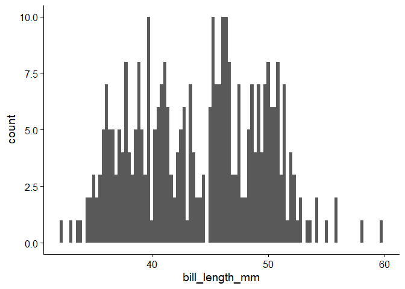<!-- -->

``` r
ggplot(torgersenpen) +
  aes(x = bill_length_mm, colour = sex, fill = sex) +
  geom_histogram(binwidth = 1.5,  position = "dodge") +
  theme_cowplot()
```

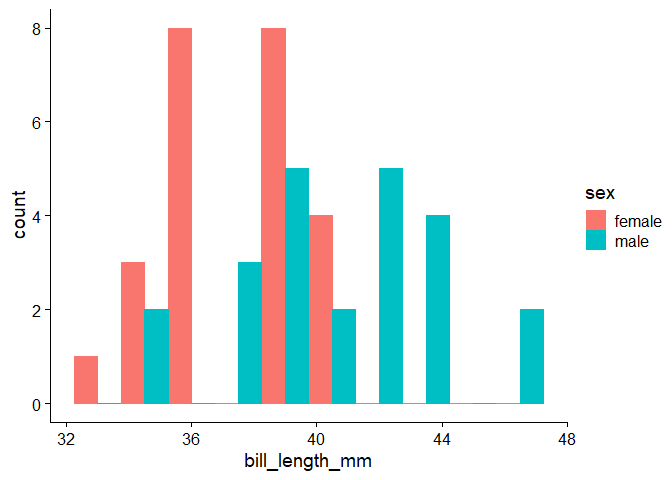<!-- -->

Residuals are the difference between an observed data value and a
predicted data value. When we plot them, it allows us to see visually
whether or not the data is normal or not. Using lm(), we can look at the
residuals of the linear models we make. So, for our first relationship
we want to look at (bill length and species), the code follows this
pattern: name of linear model \<- lm(bill length depends on(~) species,
from the data frame fullframe)

We can do a similar thing with our second relationship (bill length and
sex). The one thing that needed to be changed was the fact that the data
set torgersenpen had the specific data we needed, without the clutter of
the fullframe data set.

plot() graphs the linear models that you just made.

``` r
lmspecieslength <- lm(bill_length_mm ~ species, data = fullframe)
summary(lmspecieslength)
```

    ## 
    ## Call:
    ## lm(formula = bill_length_mm ~ species, data = fullframe)
    ## 
    ## Residuals:
    ##     Min      1Q  Median      3Q     Max 
    ## -7.9338 -2.2314  0.0686  2.0674 12.0686 
    ## 
    ## Coefficients:
    ##                  Estimate Std. Error t value Pr(>|t|)    
    ## (Intercept)       38.8240     0.2456  158.06   <2e-16 ***
    ## speciesChinstrap  10.0099     0.4358   22.97   <2e-16 ***
    ## speciesGentoo      8.7074     0.3649   23.86   <2e-16 ***
    ## ---
    ## Signif. codes:  0 '***' 0.001 '**' 0.01 '*' 0.05 '.' 0.1 ' ' 1
    ## 
    ## Residual standard error: 2.968 on 332 degrees of freedom
    ## Multiple R-squared:  0.7056, Adjusted R-squared:  0.7038 
    ## F-statistic: 397.8 on 2 and 332 DF,  p-value: < 2.2e-16

``` r
lmsexlength <- lm(bill_length_mm ~ sex, data = torgersenpen)
summary(lmsexlength)
```

    ## 
    ## Call:
    ## lm(formula = bill_length_mm ~ sex, data = torgersenpen)
    ## 
    ## Residuals:
    ##    Min     1Q Median     3Q    Max 
    ## -5.987 -1.754  0.513  1.929  5.413 
    ## 
    ## Coefficients:
    ##             Estimate Std. Error t value Pr(>|t|)    
    ## (Intercept)  37.5542     0.5390  69.673  < 2e-16 ***
    ## sexmale       3.0328     0.7705   3.936 0.000284 ***
    ## ---
    ## Signif. codes:  0 '***' 0.001 '**' 0.01 '*' 0.05 '.' 0.1 ' ' 1
    ## 
    ## Residual standard error: 2.641 on 45 degrees of freedom
    ## Multiple R-squared:  0.2561, Adjusted R-squared:  0.2396 
    ## F-statistic: 15.49 on 1 and 45 DF,  p-value: 0.0002844

``` r
plot(lmspecieslength)
```

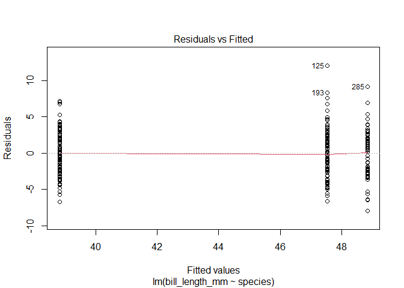<!-- -->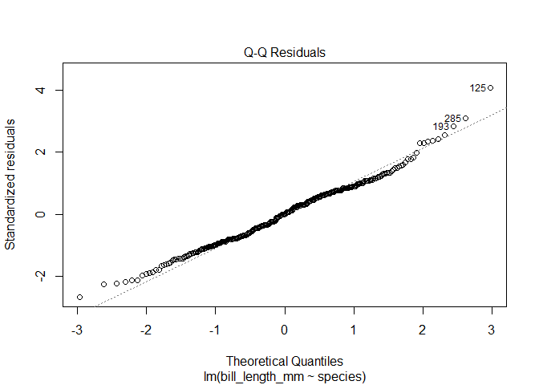<!-- -->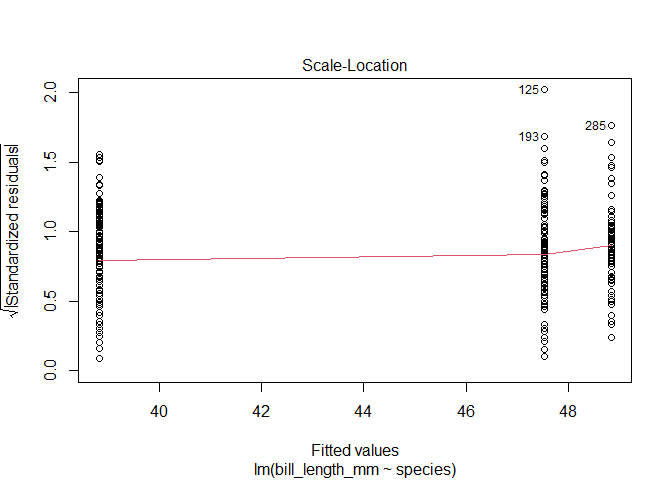<!-- -->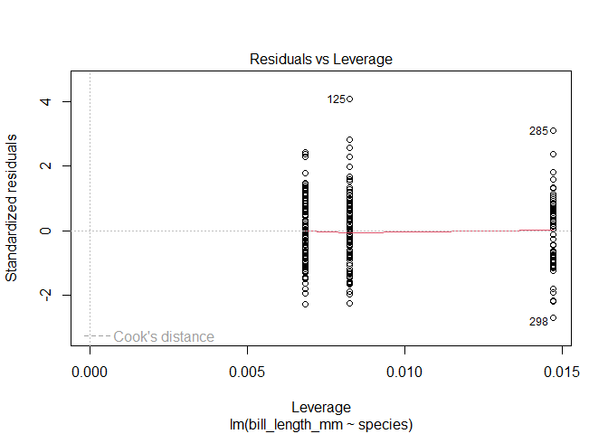<!-- -->

``` r
plot(lmsexlength)
```

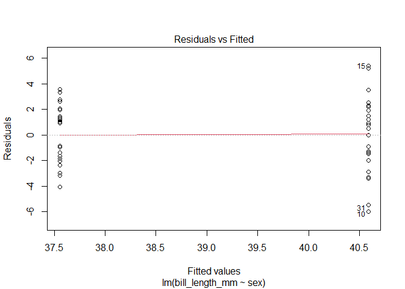<!-- -->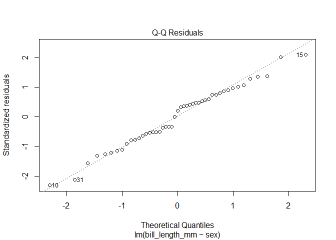<!-- -->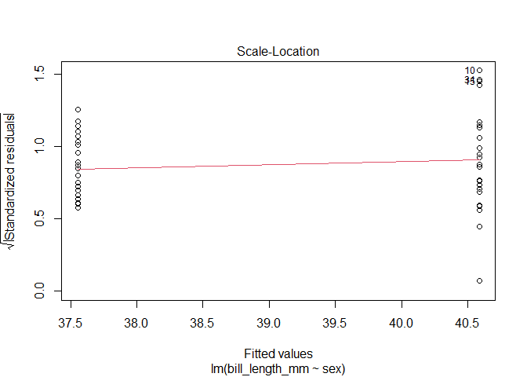<!-- -->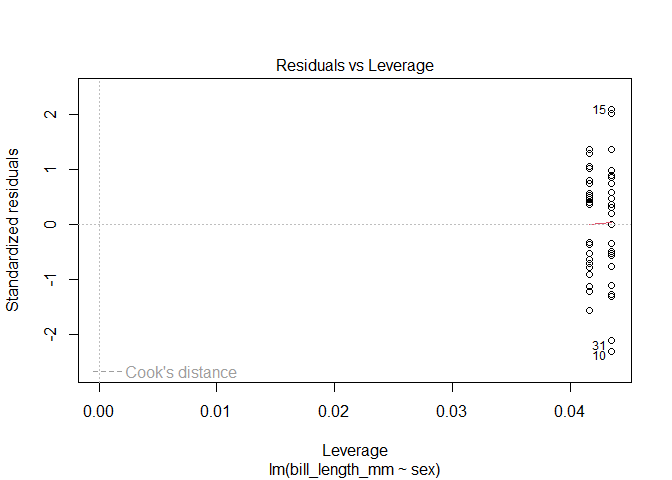<!-- -->

### 4. Discuss the residuals

Although these graphs are a lot, the main ones we will focus on (to stay
within the scope of this tutorial) are the QQ plots. A QQ plot basically
shows how well the data matches the theoretical normal distribution. If
all of the points are roughly along the dotted line, that means the data
is mostly normally distributed. If the data points do not fit along the
line at all it means the data is highly skewed.

For these, it looks like the data is fairly normalized. The data on both
the bill length ~ species and the bill length ~ sex look normal with
closely fit data on the line. Normally, this would be it for making sure
our data is normalized since it already looks normal, but the following
code gives some tips on how to normalize a skewed set.

### 5. Figure out how to normalize the data and plot residuals

Using this following code, this allows us to take log10 of the bill
length. Although our data looks fairly normalized, what would happen if
you took the log10 of it?

``` r
fullframe$log10bill_length <- log10(fullframe$bill_length_mm)
simple.eda(fullframe$log10bill_length)
```

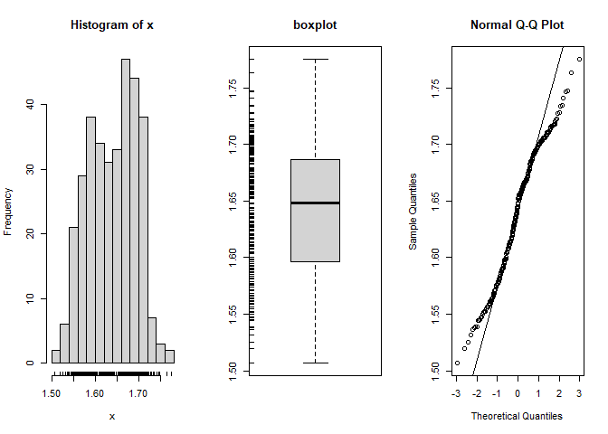<!-- -->
As you can see, it doesn’t make it that much better, it even makes the
QQ plot look worse. Since we are lucky with a normal data set, we don’t
need to use any normalizing functions.

\#Visualization of Your Data

The Hypotheses that we are testing are: -Is Bill Length in Penguins from
Torgersen’s Island Sex Dependent? -Is Bill Length different between
penguins of different species?

We will be visualizing “Is Bill Length in Penguins from Torgersen’s
Island is Sex Dependent.”

First view your data and get familiar with your variables. In this
tutorial we will be testing if the Bill Length is different between the
3 species, and if Bill length in Penguins from Torgersen’s Island is Sex
Dependent.

There are two simple ways to get a basic view of your data. You can
simply type the name of your dataset to view the full data. You can also
use summary(YourDataSet) to view the dataset with some summary
statistics. Try both bellow!

\##View Data

``` r
summary(torgersenpen)
```

    ##    species             island          bill_length_mm  bill_depth_mm  
    ##  Length:47          Length:47          Min.   :33.50   Min.   :15.90  
    ##  Class :character   Class :character   1st Qu.:36.65   1st Qu.:17.45  
    ##  Mode  :character   Mode  :character   Median :39.00   Median :18.40  
    ##                                        Mean   :39.04   Mean   :18.45  
    ##                                        3rd Qu.:41.10   3rd Qu.:19.25  
    ##                                        Max.   :46.00   Max.   :21.50  
    ##  flipper_length_mm  body_mass_g       sex                 year     
    ##  Min.   :176.0     Min.   :2900   Length:47          Min.   :2007  
    ##  1st Qu.:187.5     1st Qu.:3338   Class :character   1st Qu.:2007  
    ##  Median :191.0     Median :3700   Mode  :character   Median :2008  
    ##  Mean   :191.5     Mean   :3709                      Mean   :2008  
    ##  3rd Qu.:195.5     3rd Qu.:4000                      3rd Qu.:2009  
    ##  Max.   :210.0     Max.   :4700                      Max.   :2009

We created a dataset for Penguins in Torgersen’s Island called
“torgersenpenguins”. Simply type in the dataset’s name to view the data.
Try bellow.

``` r
torgersenpen
```

    ## # A tibble: 47 × 8
    ##    species island    bill_length_mm bill_depth_mm flipper_length_mm body_mass_g
    ##    <chr>   <chr>              <dbl>         <dbl>             <dbl>       <dbl>
    ##  1 Adelie  Torgersen           39.1          18.7               181        3750
    ##  2 Adelie  Torgersen           39.5          17.4               186        3800
    ##  3 Adelie  Torgersen           40.3          18                 195        3250
    ##  4 Adelie  Torgersen           36.7          19.3               193        3450
    ##  5 Adelie  Torgersen           39.3          20.6               190        3650
    ##  6 Adelie  Torgersen           38.9          17.8               181        3625
    ##  7 Adelie  Torgersen           39.2          19.6               195        4675
    ##  8 Adelie  Torgersen           41.1          17.6               182        3200
    ##  9 Adelie  Torgersen           38.6          21.2               191        3800
    ## 10 Adelie  Torgersen           34.6          21.1               198        4400
    ## # ℹ 37 more rows
    ## # ℹ 2 more variables: sex <chr>, year <dbl>

It is important to understand the type of variables you have to
understand how to best visualize them. There is numerical, or
quantitative variables and categorical or qualitative variables. In our
data set, type of island, and sex are our categorical variables and bill
length is our numerical variable. Therefore, we will be using graphs
that will compare categorical and numerical values. These include a
Boxplot, Histogram and Bargraph.

To start we will visualize the data comparing Bill Length by Sex to
visuzlize if there is a significant differrence in Bill Length,
depending on Sex.

\##Basic boxplot

Our independent variable is sex, and our dependent variable in this
hypothesis is bill length. Therefore we will structure the code
boxplot(dependentvariable ~ indapendent variable). xlab and ylab are
used to name the x and y axis. main is used to create a title for the
whole graph, and col allows us to customize the colors of our graph.

``` r
boxplot(bill_length_mm ~ sex, data = torgersenpen,
        xlab = "Sex",
        ylab = "Bill Length",
        main = "Boxplot of Bill Length by Sex",
        col = c("lightblue", "lightpink"))
```

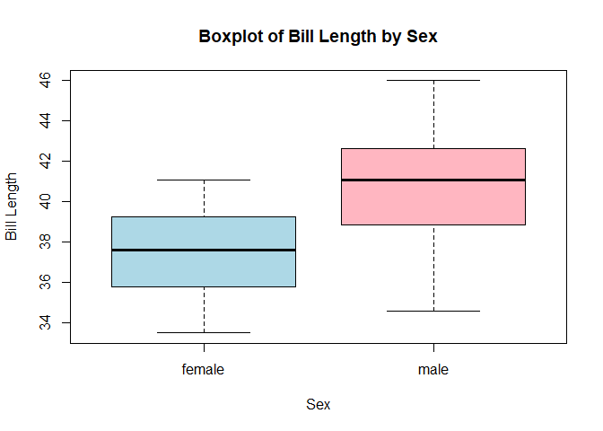<!-- -->
\##Jitter Boxplot Now we will add jitter to our boxplot :

The code bellow shows a different way to code for a boxplot using
ggplot. In this case, our x(independent) and y(dependent) variables stay
the same. We add jitter using the function geom_jitter. We also changed
the scale_x_discrete to change the lables of Male and Female on our x
axis.

``` r
ggplot(torgersenpen) +
  aes(x = factor(sex), y = bill_length_mm) +
  geom_boxplot() +
  geom_jitter(color="black", size=0.4, alpha=0.9) +
  theme_cowplot() +
  ylab("Bill Length (mm)")+
  xlab(c(" "))+
  scale_x_discrete(labels=c("Female","Male"))
```

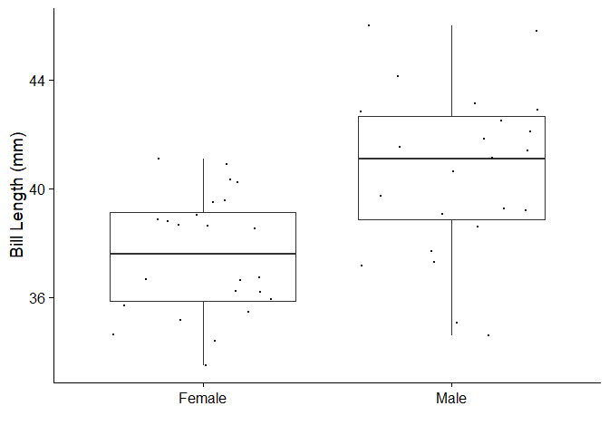<!-- -->
\###Analyze Boxplot Now you want to analyze your results and look for
any differences in the data for our boxplots :

In both of boxplot we can see a significant difference between the Bill
Length. It seems that males on average have a higher bill length than
female penguins from Torgersen’s island. Of course we will have to use a
statistical test to check if this correlation is actually significant.

\##Histogram

Next we will create a Histogram to visualize the same thing in the data.

In our histogram we want to display the Bill Length on the x-axis and
separate these values by female and male.

First lets create a histogram that includes just the Bill Length. To do
this simply use the ggplot function as we have before, with the
geom_histogram function.

``` r
ggplot(torgersenpen) +
  aes(x = bill_length_mm) +
  geom_histogram(bins=100) +
  theme_cowplot()+
  xlab("Bill Length (mm)") + 
  ylab("Count")
```

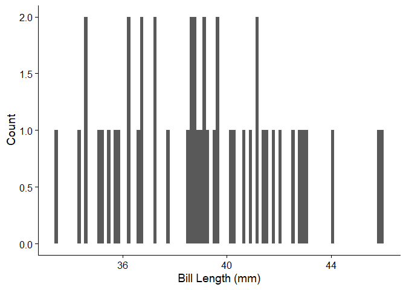<!-- -->

Next lets separate these results by sex : To do this, we will use
similar code as before, adding aes(x = dependent variable, color =
dependent variable, full = dependent variable). This will separate the
data by the dependent variable by color.

``` r
ggplot(torgersenpen) +
  aes(x = bill_length_mm, color = sex, fill = sex) +
  geom_histogram(binwidth = 0.5, position = "dodge") +
  theme_cowplot()+
    xlab("Bill Length") + 
  ylab("Count")
```

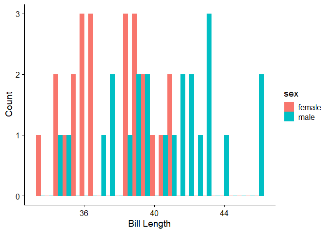<!-- -->

Finally, lets make these results more aesthetically pleasing :

``` r
ggplot(torgersenpen) +
  aes(x = bill_length_mm,  color= sex, fill = sex) + 
  geom_density(alpha=.3) +
  theme_cowplot()+
  xlab("Bill Length (mm)") + 
  ylab("Count")
```

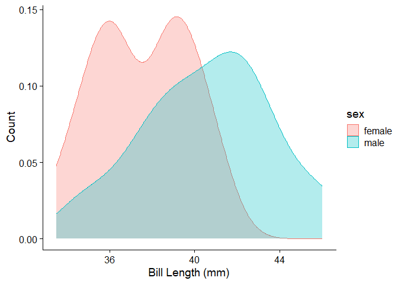<!-- -->
\###Analyze Histogram Now you want to analyze your results and look for
any differences in the data for our Histogram :

Our Histogram displays similar results to our boxplot, in which we can
see a significant difference between the Bill Length seperated by sex.
It seems that males on average have a higher bill length than female
penguins from Torgersen’s island. Of course we will have to use a
statistical test to check if this correlation is actually significant.

\##Bar Chart Laslty, we will be making a bar chart using the ggplot
function. Our data set and variables stay the same. To create a bar
chart we will use the function geom_bar within our code.

``` r
ggplot(torgersenpen, aes(x = sex, y=bill_length_mm), fill = Type) + 
  geom_bar(stat = "summary", position = "dodge")+ 
  scale_fill_grey()+ 
  labs(title = "Mean Bill Length by Sex (Torgersen Penguins)",
       x = "Sex",
       y = "Mean Bill Length (mm)") +
  theme_cowplot()
```

    ## No summary function supplied, defaulting to `mean_se()`

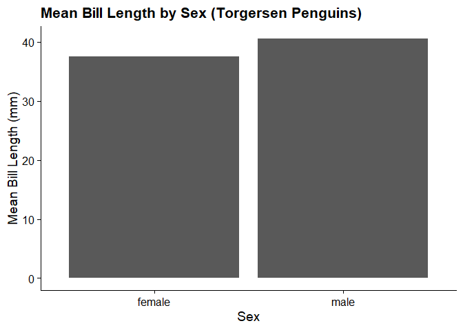<!-- -->

This will create a very basic Bar Chart to visualize our Data.

\###Analyze Bar Chart

As you can see, our graphs are all consistent in that Males appear to
have a higher average Bill Lenghth then Female penguins on Torgersen’s
island. We must test this with statistical models to verify if the
correlation is actually there.

\##Practice Using Second Hypothesis Now we will ask you to test the
second hypothesis, using the dataset fullframe, to compare the bill
lengths among penguins from different species. There is space for you to
practice completing a boxplot, histogram, and barchart. If you are to
get stuck, the answers are bellow for each visualization. Also attemtpt
to analyze the graphs.

\###Practice Boxplot

Analysis:

\###Practice Histogram

Analysis:

\###Practice Bar Chart

Analysis:

\###Answers Boxplot

``` r
#Without Jitter
boxplot(bill_length_mm ~ species, data = fullframe,
        xlab = "Species",
        ylab = "Bill Length",
        main = "Boxplot of Bill Length by Species",
        col = c("lightblue", "lightpink", "lightgreen"))
```

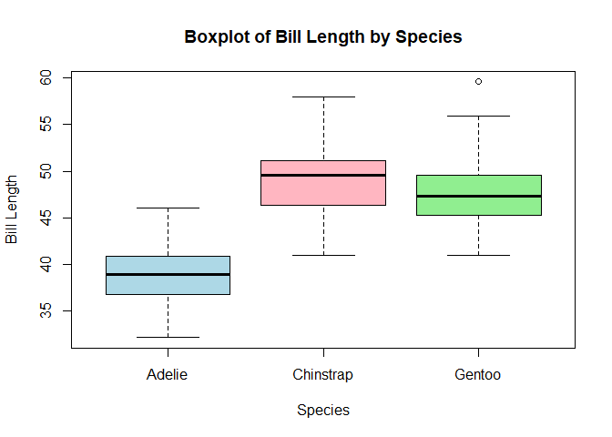<!-- -->

``` r
#With Jitter
ggplot(fullframe) +
  aes(x = factor(species), y = bill_length_mm) +
  geom_boxplot() +
  geom_jitter(color="black", size=0.4, alpha=0.9) +
  theme_cowplot() +
  ylab("Bill Length (mm)")+
  xlab("Species")
```

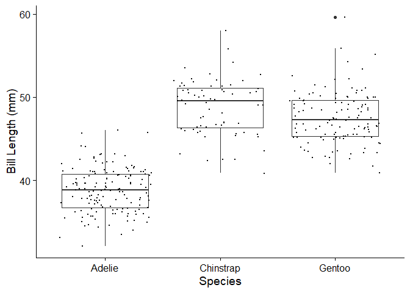<!-- -->
Analysis: Our boxplot suggests that Chinstrap penguins have the highest
average bill length, and adelie have the lowest average bill length.

\###Answers Histogram

``` r
#Just Bill Length
ggplot(fullframe) +
  aes(x = bill_length_mm) +
  geom_histogram(bins=100) +
  theme_cowplot()+
  xlab("Bill Length (mm)") + 
  ylab("Count")
```

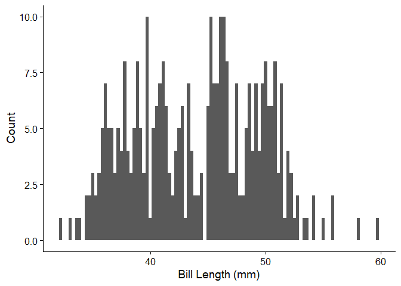<!-- -->

``` r
#Bill Length Seperated by Species

ggplot(fullframe) +
  aes(x = bill_length_mm, color = species, fill = species) +
  geom_histogram(binwidth = 0.5, position = "dodge") +
  theme_cowplot()+
    xlab("Bill Length") + 
  ylab("Count")
```

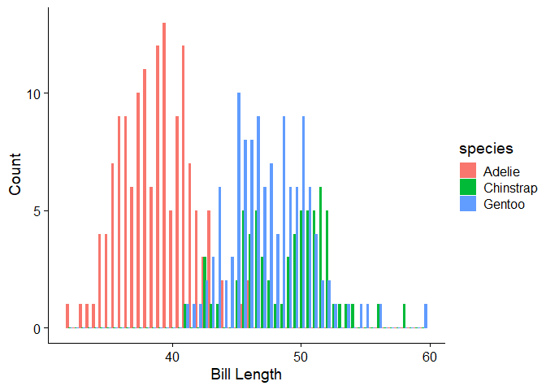<!-- -->

``` r
ggplot(fullframe) +
  aes(x = bill_length_mm,  fill = species) + 
  geom_density(alpha=.3) +
  theme_cowplot()+
  xlab("Bill Length (mm)") + 
  ylab("Count")
```

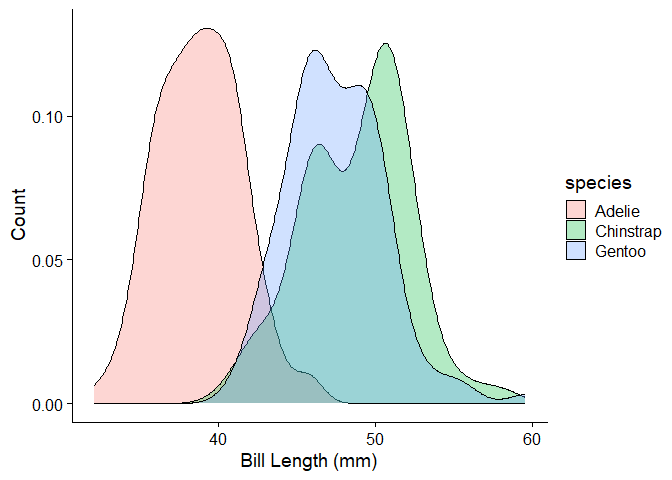<!-- -->
Analysis: Our histogram suggests that Chinstrap penguins have the
highest average bill length, and adelie have the lowest average bill
length. This is consistent with the boxplot.

\###Answers Bar Chart

``` r
ggplot(fullframe, aes(x = species, y=bill_length_mm), fill = Type) + 
  geom_bar(stat = "summary", position = "dodge")+ 
  scale_fill_grey()+ 
  labs(title = "Mean Bill Length by Island",
       x = "Species",
       y = "Mean Bill Length (mm)") +
  theme_cowplot()
```

    ## No summary function supplied, defaulting to `mean_se()`

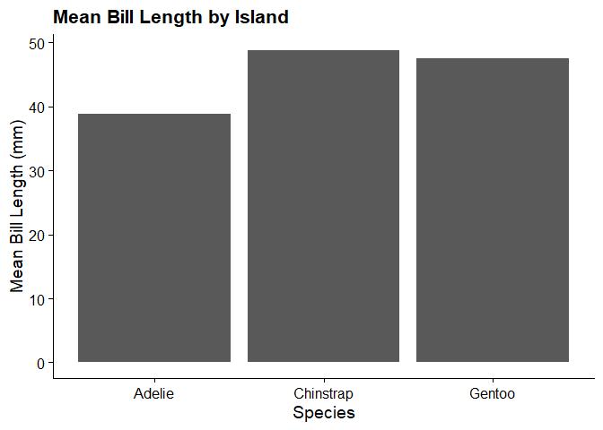<!-- -->
Analysis:Our Bar Chart suggests that Chinstrap penguins have the highest
average bill length, and adelie have the lowest average bill length.
This is consistent with the boxplots and the histograms.

\##Analyzing Data using t-test, and Anova Now you will learn how to
analyze data using T-tests and Anova.

First, Which type of analysis to use / using t-test, anova…

- Recognize the differences between one-way, two-way, mixed, or ANCOVA
  anova test, execute the test and interpret the results
  - Determine if the explanatory variable(s) is continuous, discrete, or
    mixed
  - Understand the meaning of p-values and how it relates to a normal
    distribution
- Understand the differences between one-sample t test, two-sample t
  test, or paired t test, execute the test and interpret the results
  - Learn how to assess an experimental design in order to choose the
    appropriate t-test
  - Understand probability distributions and how it relates to t-tests

\#Checking dataframe structure using str()

``` r
str(torgersenpen)
```

    ## tibble [47 × 8] (S3: tbl_df/tbl/data.frame)
    ##  $ species          : chr [1:47] "Adelie" "Adelie" "Adelie" "Adelie" ...
    ##  $ island           : chr [1:47] "Torgersen" "Torgersen" "Torgersen" "Torgersen" ...
    ##  $ bill_length_mm   : num [1:47] 39.1 39.5 40.3 36.7 39.3 38.9 39.2 41.1 38.6 34.6 ...
    ##  $ bill_depth_mm    : num [1:47] 18.7 17.4 18 19.3 20.6 17.8 19.6 17.6 21.2 21.1 ...
    ##  $ flipper_length_mm: num [1:47] 181 186 195 193 190 181 195 182 191 198 ...
    ##  $ body_mass_g      : num [1:47] 3750 3800 3250 3450 3650 ...
    ##  $ sex              : chr [1:47] "male" "female" "female" "female" ...
    ##  $ year             : num [1:47] 2007 2007 2007 2007 2007 ...

``` r
str(biscoepen)
```

    ## tibble [165 × 8] (S3: tbl_df/tbl/data.frame)
    ##  $ species          : chr [1:165] "Adelie" "Adelie" "Adelie" "Adelie" ...
    ##  $ island           : chr [1:165] "Biscoe" "Biscoe" "Biscoe" "Biscoe" ...
    ##  $ bill_length_mm   : num [1:165] 37.8 37.7 35.9 38.2 38.8 35.3 40.6 40.5 37.9 40.5 ...
    ##  $ bill_depth_mm    : num [1:165] 18.3 18.7 19.2 18.1 17.2 18.9 18.6 17.9 18.6 18.9 ...
    ##  $ flipper_length_mm: num [1:165] 174 180 189 185 180 187 183 187 172 180 ...
    ##  $ body_mass_g      : num [1:165] 3400 3600 3800 3950 3800 3800 3550 3200 3150 3950 ...
    ##  $ sex              : chr [1:165] "female" "male" "female" "male" ...
    ##  $ year             : num [1:165] 2007 2007 2007 2007 2007 ...

``` r
str(dreampen)
```

    ## tibble [123 × 8] (S3: tbl_df/tbl/data.frame)
    ##  $ species          : chr [1:123] "Adelie" "Adelie" "Adelie" "Adelie" ...
    ##  $ island           : chr [1:123] "Dream" "Dream" "Dream" "Dream" ...
    ##  $ bill_length_mm   : num [1:123] 39.5 37.2 39.5 40.9 36.4 39.2 38.8 42.2 37.6 39.8 ...
    ##  $ bill_depth_mm    : num [1:123] 16.7 18.1 17.8 18.9 17 21.1 20 18.5 19.3 19.1 ...
    ##  $ flipper_length_mm: num [1:123] 178 178 188 184 195 196 190 180 181 184 ...
    ##  $ body_mass_g      : num [1:123] 3250 3900 3300 3900 3325 ...
    ##  $ sex              : chr [1:123] "female" "male" "female" "male" ...
    ##  $ year             : num [1:123] 2007 2007 2007 2007 2007 ...

Since our full dataframe is already established, we can begin exploring
the data. We will first assess whether the bill length is different
between the three species. To do this, we will conduct an anova. - What
type of variable is our explanatory variable? Response variable?

``` r
billLaov <- aov(bill_length_mm ~ species, data = fullframe)
summary(billLaov)
```

    ##              Df Sum Sq Mean Sq F value Pr(>F)    
    ## species       2   7009    3505   397.8 <2e-16 ***
    ## Residuals   332   2925       9                   
    ## ---
    ## Signif. codes:  0 '***' 0.001 '**' 0.01 '*' 0.05 '.' 0.1 ' ' 1

What type of ANOVA did our code conduct? Why was this type of ANOVA
conducted? What do the results of our ANOVA tell us?

Next, we will test whether or not the bill length in penguins for
Torsergen’s Island is sex-dependent. To do this, we will conduct yet
another anova to determine the significance (if any) in this
relationship.

``` r
billLaov2 <- aov(bill_length_mm ~ sex, data = torgersenpen)
summary(billLaov2)
```

    ##             Df Sum Sq Mean Sq F value   Pr(>F)    
    ## sex          1  108.0  108.03   15.49 0.000284 ***
    ## Residuals   45  313.8    6.97                     
    ## ---
    ## Signif. codes:  0 '***' 0.001 '**' 0.01 '*' 0.05 '.' 0.1 ' ' 1

What type of ANOVA did our code conduct? Why was this type of ANOVA
conducted? What do the results of our ANOVA tell us?

I want you to think about the other available statistical tests which
are available to us in R, and which would be more appropriate for
completing the task of comparing bill lengths between sexes on Torsergen
Island. Would the following code be appropriate for the task? Why or why
not?

``` r
t.test(bill_length_mm ~ sex, data = torgersenpen)
```

    ## 
    ##  Welch Two Sample t-test
    ## 
    ## data:  bill_length_mm by sex
    ## t = -3.91, df = 40.162, p-value = 0.0003468
    ## alternative hypothesis: true difference in means between group female and group male is not equal to 0
    ## 95 percent confidence interval:
    ##  -4.600230 -1.465349
    ## sample estimates:
    ## mean in group female   mean in group male 
    ##             37.55417             40.58696

Finally, we will test the hypothesis that bill length is dependent on
the interaction between sex and species. What type of ANOVA would be
best for this analysis? Provide the code below.

``` r
anova3 <- aov(bill_length_mm ~ sex * species, data = fullframe)
summary(anova3)
```

    ##              Df Sum Sq Mean Sq F value Pr(>F)    
    ## sex           2   1179     590 110.201 <2e-16 ***
    ## species       2   6976    3488 651.931 <2e-16 ***
    ## sex:species   2     24      12   2.289  0.103    
    ## Residuals   328   1755       5                   
    ## ---
    ## Signif. codes:  0 '***' 0.001 '**' 0.01 '*' 0.05 '.' 0.1 ' ' 1

What do the results of this ANOVA tell us? Why are we able to run a
two-way ANOVA with the given variables? Are there statistically
significant results? Why wouldn’t we use a linear model in this type of
analysis?
